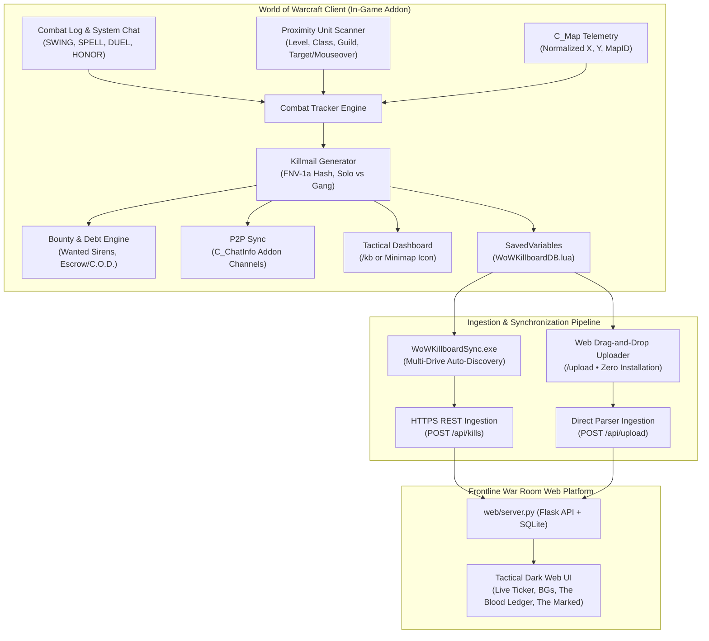

# WoW Killboard — Frontline War Room

[](CHANGELOG.md)
[](https://github.com/dagariane-commits/WoW_Killboard/actions/workflows/ci.yml)
[](https://github.com/dagariane-commits/WoW_Killboard/actions/workflows/codeql.yml)
[](docs/TAINT_AND_COMPATIBILITY.md)
[](docs/TAINT_AND_COMPATIBILITY.md)
[](dist/WoWKillboardSync.exe)
[](LICENSE)

Hey everyone! I'm just a dude who used AI to help create my very first World of Warcraft addon.

**WoW Killboard** is a community killboard for WoW that tracks open-world PvP kills, certified 1v1 duels, battleground stats, blood bounties, and wilderness PvE deaths across **World of Warcraft: Forever**, **Classic Era**, **Anniversary**, and modern **Retail** clients.

*(Note: Hands-on testing has primarily been focused in WoW Forever Beta. The code is written with parity in mind for Classic Era, Anniversary, and Retail as well, but multi-version testing is ongoing!)*

I really hope you like it! It's currently in early beta, so please test it out, give me your feedback, and let me know what you'd like to see added so I can keep making it better.

---

## Technical Documentation & Wiki

Comprehensive technical documentation is maintained in the [`docs/`](docs/) directory:

- 📖 **[Master Technical Wiki](docs/README.md)** — Architectural index and developer portal.
- 🏛️ **[System Architecture Specification](docs/ARCHITECTURE.md)** — In-depth breakdown of the 3-tier model, data contracts, and FNV-1a hashing.
- ⚡ **[Beta Tester Quickstart Guide](docs/BETA_TESTER_QUICKSTART.md)** — 2-minute setup, in-game controls, and automated AI bug reporting.
- ⚔️ **[Combat Telemetry & Gang Engine](docs/COMBAT_ENGINE.md)** — 15-second sliding gang clustering, 1v1 duels, and BG scoreboard telemetry.
- 🩸 **[Blood Bounties & The Marked](docs/BOUNTY_SYSTEM.md)** — Execution contracts, strict open-world PvP gating, anti-win-trade rules, and debtor radar.
- 🛡️ **[Taint Security & Compatibility](docs/TAINT_AND_COMPATIBILITY.md)** — Complete guide to our zero-taint standard across all 4 WoW client flavors.
- 📊 **[Stress Testing & Performance Benchmarks](docs/STRESS_TESTING.md)** — Multi-tier load testing, parser benchmarking (7,200+ rec/s), and API concurrency.
- ☁️ **[Dedicated Linux VPS Deployment](docs/DEPLOYMENT_VPS.md)** — AWS Lightsail runbook, automated SSL/TLS via Caddy, and backup automation.
- 🗺️ **[Forward Strategic Roadmap](docs/ROADMAP.md)** — Phased roadmap covering public launch, guild war rooms, and ranked seasons.
- 🚀 **[Public Release & Distribution Playbook](docs/PUBLIC_RELEASE_PLAYBOOK.md)** — Guide for packaging, CurseForge/Wago distribution, and hosting.
- 📝 **[Semantic Version Change Log](CHANGELOG.md)** — Full changelog trail from initial prototype to v1.0.5 release.
- 🤝 **[Contributing Guidelines](CONTRIBUTING.md)** — Development standards and PR checklist for open-source contributors.
- ⚖️ **[Legal, Safety & Compliance Guide](docs/LEGAL_AND_COMPLIANCE.md)** — Authorship, Blizzard Add-on Policy compliance, zero PII, and anti-cheat safety.

---

## Architecture at a Glance

Because World of Warcraft addons operate in an isolated Lua sandbox without raw outbound socket capabilities, WoW Killboard operates across three synchronized tiers:



---

## Core Feature Highlights

### 1. In-Game Addon (`Addon/WoWKillboard/`)
- **Integrated Character Portrait Medallion & Dynamic Level Coin**:
  - Circular unit-frame player portrait (`WoWKillboardPlayerPortrait`, 48x48) anchored to the top-left at `(12, -8)` on strata `HIGH` with circular alpha mask and proportional 60x60 gold tracking ring (`MiniMap-TrackingBorder`).
  - Overlapping 20x20 circular level medallion at `BOTTOMRIGHT (2, -2)` displaying bold gold player level text updating dynamically on `UNIT_LEVEL`, `PLAYER_LEVEL_UP`, and `PLAYER_XP_UPDATE`. Title string `WoW Killboard v1.0.5` anchored vertically centered with the portrait center at `(10, 0)`.
- **Rich Red & Blue Faction Pill Badges & Telemetry Split Bar**:
  - High-contrast rounded solid pill badges for faction columns: Solid Royal Blue `#103894` with cyan border and Alliance crest for Alliance; Solid Crimson Red `#8C1414` with orange-red border and Horde crest for Horde.
  - Telemetry ribbon visual progress bar (`UI.FactionSplitBar`, 140x12) rendering dynamic real-time Alliance/Horde war splits with drop-shadowed white text.
  - Clean local player row highlight (`[YOU]`): subtle semi-transparent background wash on `row.highlightGrad` (`0.12, 0.16, 0.24, 0.35`) with clean text tag `|cffffd100[YOU]|r` (zero harsh border box outlines).
- **Combat Feed Ability Icons & Zero-Truncation Zone Layout**:
  - Compact 18x18 ability cell (width 44px, centered at `x = 248`) displaying killing blow/hazard spell icons with interactive `GameTooltip` on hover, eliminating verbose boilerplate phrases.
  - Reallocated +64px width to the `ZONE` column (starting at `x = 448` and extending to `-6`), eliminating ellipsis clipping for complete locations like `Loch Modan (Thelsamar)` and `Undercity (Ruins of Lordaeron)`.
  - Expanded `ATTACKER` and `VICTIM` columns to 168px each to fit long player names, `<GUILD>` tags, and `[YOU]` tags without clipping.
- **Restyled "THE MARKED" Card Track Buttons**:
  - Dark slate theme `(0.08, 0.11, 0.16, 0.9)` with subtle 1px slate line border `(0.20, 0.25, 0.35, 1.0)` and pale gold text `(0.9, 0.85, 0.7, 1.0)` that shifts to a radiant gold border and bright yellow text on hover.
- **Strict 3-Theme Architecture (WKB Theme, ElvUI, Classic)**:
  - **Theme: WKB Theme (1:1 Web Mirror)**: 100% 1:1 visual parity with `wowkillboard.com`. Master canvas `#040609` (`0.015, 0.020, 0.030, 0.98`) with 1px brass border `#947338`, elevated `#0B0F17` card panels with 1px `#1E293B` borders, solid bright brass gold active pill buttons with black text, active tab gold bottom line, alternating row striping, and vivid telemetry ribbon coloring (`|cff0080ff% A|r`, `|cffff2020% H|r`, `|cffffd200Zone|r`, `|cffff8000Casualties|r`).
  - **Theme: ElvUI**: Minimalist dark styling featuring master frame `#0A0A0A`, card backdrops `#141414`, strict 1px flat black borders, and flat dark gray buttons with bright white accent borders.
  - **Theme: Classic Blizzard Stone**: Authentic Blizzard dialog stone backgrounds (`UI-DialogBox-Background`), stone and gold borders (`UI-DialogBox-Border`), and parchment accents.
  - **Zero-Taint Theme Dropdown & Switcher**: Select between themes via the Settings dialog dropdown (`Classic`, `ElvUI`, `WKB Theme`), minimap right-click, or `/kb theme [wkb|elvui|classic]`.
- **Mode Filter Pills & Clean Tab Navigation (`/kb`)**:
  - **Contextual Mode Filtering**: Tactile pill buttons (`[ World ]`, `[ BGs ]`, `[ Duels ]`, `[ Arenas ]`) in the sub-toolbar immediately filter combat rows and re-aggregate leaderboard standings. Active pills glow with gold border `#D4AF37` and dark brass fill.
  - **Zero Duplication Navigation**: Strictly 5 clean tabs for PvP (`Intel`, `Leaderboards`, `The Marked`, `Call to Arms`, `Danger Zones`) and 5 clean tabs for PvE (`Casualties`, `Deadly Hazards`, `Notorious Elites`, `Rescue Beacons`, `Zone Mortality`), completely removing duplicate Hazards tabs.
- **Zero-Taint Isolated Dashboard (`/kb`)**:
  - 100% template-free pure Lua widgets (`BackdropTemplate`). Zero XML template dependencies (`UIPanelButtonTemplate`, etc.). Zero `UISpecialFrames` pollution.
  - Safe ESC key event propagation (`SetPropagateKeyboardInput`).
  - Guaranteed **88px clear margin** eliminating navigation tab and filter button overlap.
- **Strict Realm Isolation & Interactive PvE/PvP Stats Toggle**:
  - **Active Realm Header Display**: Prominently displays the player's active realm and ruleset badge (e.g. `Realm: Crusader Strike [PvP]` or `Realm: Wild Growth [PvE]`).
  - **Interactive Stats Toggle**: Header toggle button (`[PVP STATS]` / `[PVE STATS]`) switches between Contested PvP and Wilderness PvE statistics on the fly.
  - **Default Ruleset Lockdown**: RP and PvE servers automatically default to PvE mode, displaying the Wilderness Bestiary and Fallen Mortals instead of PvP leaderboards.
  - **Zero Cross-Realm Leakage**: Normalized realm-matching ensures players on a PvP realm only see combatants from their active realm.
- **Balanced 3-Card Tactical Stat Header**:
  - `SESSION COMBAT K/D` (Cyan) — Active session kills, deaths, and K/D ratio.
  - `1v1 DUELS RECORD` (Gold) — Dedicated duel tracking (wins, losses, win %).
  - `BATTLEGROUNDS RECORD` (Blue) — Battleground matches (wins, losses, win %).
- **1v1 Duel Match Engine**:
  - Automatically captures duel outcomes (knockouts and forfeits) via `CHAT_MSG_SYSTEM`.
  - Mints certified duel killmails with exact location GPS tags.
- **Temporal Hostile Gang Clustering**:
  - Sliding 15-second window correlates all hostile combatants engaging a victim to distinguish certified 1v1 solo kills from gang ganks.
- **Battleground Telemetry**:
  - Scoreboard integration (`UPDATE_BATTLEFIELD_SCORE`): Real-time damage done, healing done, and objective scores.
- **Guild War Tracking & In-Game Leaderboards**:
  - In-game guild affiliation indexing via `GetGuildInfo(unit)`.
  - In-game Top War Guilds ranking table inside the `/kb` dashboard.
- **War Horn: Call to Arms & Vanguard Manhunt (World PvP Only)**:
  - Sound the emergency War Horn via `/warhorn`, `/killboard warhorn`, `/manhunt`, `/kb manhunt`, or header button `[ 📯 WAR HORN ]`.
  - **Strict Open-World PvP Gating**: Cannot be sounded in dungeons, raids, battlegrounds, or arenas (`IsInInstance()` protection).
  - Transmits exact GPS coordinates, zone, subzone, and hostile attacker telemetry to Guild Chat, Party/Raid, Yell, and P2P addon channels.
  - Automatically enables a 10-minute Auto-Invite listener (`EnsureRaidConversion`): whispering `"rally"`, `"war"`, `"backup"`, or `"invite"` automatically invites the ally to the vanguard squad!
  - Pops up an on-screen Reinforcement Alert dialog for guildmates with 1-click `"⚔️ Answer the Call"` response.
- **The Blood Ledger: Execution Contracts & The Marked (World PvP Only)**:
  - Place gold bounties upon enemy players via `/kb bounty <Target> <Gold>`.
  - **Strict Open-World PvP Gating**: Bounties can strictly only be declared on the open battlefields of Azeroth. Blocked inside instances/BGs.
  - In-game death vengeance prompt: Falling to an enemy in open-world combat prompts the victim to immediately declare a blood bounty.
  - **Delayed Last-Seen Vicinity**: Bounty rows display the last confirmed combat zone and elapsed time (`Last Sighted: Stranglethorn Vale ~14m ago`).
  - Anti-win-trade heuristics (level deltas, guild collusion protection, duplicate kill cooldowns).
  - Anti-name-change evasion via permanent character GUID tracking (`Player-XXXX-XXXXXXXX`).
  - **The Marked (Defaulted Debts)**: Debtor sirens (`PlaySound(8959)`) and screen alarms when an Oathbreaker is near.
  - 1-click mail redemption portal with a 10% administrative fee.

- **Head-to-Head Blood Feuds & Rules of Engagement (ROE)**:
  - Supports 1v1 and Guild Wars with customized kill goals (e.g. first to 100 kills).
  - Anti-Lowbie Floor (Level 55+), 2x Underdog Multipliers (1v2, 1v3), and Zerg Filter (0 points for 3+ on 1).
  - Web UI tab **"⚔️ Blood Feuds & Blacklist"** tracks real-time progress and declares victors.
- **Zero-Gold Wagers & Realm KOS Blacklist**:
  - Defeated guilds and rogue gankers permanently branded onto the **Realm KOS Blacklist**.
  - Proximity warning sirens (`PlaySound(8959)`) and alert dialogs (`UI:ShowKOSAlert`) in-game.
- **30-Day Anti-Guild-Hop Deserter Stain**:
  - Stamped 30-day penance bound to permanent `Player-GUID`. Leaving or `/gquit`ing a blacklisted guild preserves the KOS stain.
- **Tactical Intel & Gank Sighting Recon Wire**:
  - In-game enemy spotting commands (`/spot [notes]`, `/scout [notes]`, `/kb spot`) capture targets and GPS coordinates.
  - Broadcasts across Guild, Group/Raid, and P2P Addon channels. Live web recon ticker with Discord embeds.
- **In-Game Player Armory Lookup (`/armory [Name]`, `/killboard armory [Name]`)**:
  - Direct chat combat dossier: reports character class, level, faction, Classic Military Honor Rank, K/D, solo triumphs, KOS status, and active blood bounties without leaving the game client.
- **In-Game Database Management & 1-Click Reset (`/kb` -> `Settings`)**:
  - Dedicated Section 5 in Settings with a prominent red `[Reset Local Database]` button.
  - Instantly wipes local combat records (`WoWKillboardDB.kills`), resets cached realm carnage to 0, clears session stats, and refreshes the UI without requiring a reload.
- **In-Game Frontline Combat Stress Testing (`/kb stress [N]`)**:
  - Dynamically injects up to 250 verified synthetic kills into memory in a single frame.
  - Profiles microsecond execution time (`debugprofilestop`) and memory allocation delta (`collectgarbage`), confirming 0 FPS drops and zero Blizzard UI taint (`ActionBlocked`).
- **Early Preview Welcome & Community Feedback Modal (`/kb welcome`, `/kb feedback`)**:
  - Unobtrusive first-time login popup explaining early stage development, encouraging sharing freely across guildmates and friends, and soliciting direct feedback.
  - Interactive actions: 1-click in-game feedback dispatcher (`UI:ShowBugReportModal()`), copyable web feedback link with auto-highlighting, and "Do not show on future logins" checkbox.

### 2. Desktop Ingestion Agent (`WoWKillboardSync.exe`)
- **Standalone Windows Executable**: Zero Python installation required for players.
- **Multi-Drive Auto-Discovery**: Automatically discovers `SavedVariables/WoWKillboard.lua` across `C:`, `D:`, and `E:` drives for Retail, Classic, Classic Era, and Forever Beta.
- **Streaming Lua Tokenizer**: High-speed recursive-descent parser.

### 3. Frontline War Room Web Intelligence Platform (`web/`)
- **Sticky Top Combat & Leaderboard Filter Toolbar (`#top-combat-filters`)**:
  - Repositioned filter controls directly above `#main-content-area` across desktop and mobile.
  - **Row 1 (Timeframe)**: `[ 24 Hours ]`, `[ 7 Days ]`, `[ 30 Days ]`, `[ All-Time ]`.
  - **Row 2 (Faction & Modes)**: `[ All ]`, `[ Alliance ]`, `[ Horde ]` | `[ World ]`, `[ BGs ]`, `[ Duels ]`, `[ Arenas ]`.
  - **Sticky Mobile Sub-Bar**: `position: sticky; top: 56px; z-index: 900; background: rgba(11, 15, 23, 0.95); backdrop-filter: blur(8px); padding: 8px 12px;` on `<= 768px`.
  - Minimum 36px touch heights, `#C69B3D` solid gold active state, `#1e293b` inactive background.
- **High-Density Combat Feed & Compact Single-Line Mobile Rows**:
  - Dual-layout system: 5-column fixed grid (`180px 1fr 44px 1fr 110px`) on desktop, compact single-line row (`38px–42px`) on mobile.
  - Mobile format: `[Spec Icon] Killer (Guild) -> Victim (Guild) | Zone | 2m ago` with subtle zebra striping and victor faction accent border.
  - Capped initial combat feed display to 12 events with a compact `Load More Recent Kills` expansion trigger.
- **Interactive Sortable Competitive Leaderboards**:
  - **4-Timeframe Intervals**: `[ 24 Hours ]`, `[ 7 Days ]`, `[ 30 Days ]`, `[ All-Time ]` with instant dynamic syncing.
  - **10-Class Classic Selector Bar**: All 9 Classic classes with Blizzard class colors and instant re-ranking (`1..N`).
  - **Interactive Column Sorting**: Clickable table headers with directional indicator arrows (`▲`/`▼`) for Rank, Combatant, Guild, Faction, Kills, Solo Kills, Deaths, K/D Ratio, Wins, Losses, and Percentile.
- **Dynamic Most Wanted Grid Sizing**:
  - Automatically scales the Most Wanted showcase: renders as a single, sleek row of 5 slots when 5 or fewer bounties exist, pulling the combat feed up by ~180px and eliminating empty-state clutter.
- **High-Concurrency SQLite WAL Engine & Web Admin Console**:
  - Configured Write-Ahead Logging (`PRAGMA journal_mode=WAL;`), 10-second busy timeout, and normalized synchronous mode for non-blocking concurrent reads and burst write throughput.
  - Linked **Admin Console** directly in the site footer for 1-click cloud database wipes via master secret key.
- **Dark Warcraft Tactical War Room & Mobile/Tablet Responsive Overhaul**:
  - Immersive dark fantasy aesthetic with radial faction illumination (Alliance Blue & Horde Crimson), ambient tactical grid, and glassmorphic panels (`backdrop-filter: blur(16px)`).
  - Integrated Google typography: `'Cinzel'` for regal war room titles, `'Rajdhani'` for telemetry/meters, and `'Inter'` for combat feeds.
  - Multi-tiered responsiveness: Desktop Ultra-Wide (>1400px), Standard Desktop (1024px-1280px), Tablet Portrait/Landscape (768px-1024px), and Mobile Phones (320px-768px).
  - Clean dual-row command bridge: scrollable horizontal navigation rail (`#nav-rail`) plus slide-out Mobile Navigation Drawer (`#mobile-drawer`) with $\ge 44\text{px}$ touch targets and zero horizontal viewport blowout.
- **Most Deadly NPC Leaderboard & Fallen Mortals Stream (`#nav-deadly_npcs`, `/api/pve/leaderboard`)**:
  - Dedicated leaderboard ranking the realm's deadliest monsters, elites, and world bosses (e.g. Hogger, Son of Arugal, Stitches, Mor'Ladim, Devilsaur).
  - Top Fallen Mortals graveyard tracking characters with the most PvE deaths.
  - Live Fallen Mortals stream showing creature executions in real time.
  - Strict PvE isolation: Zero pollution of PvP feeds, K/D ratios, or bounty contracts.
- **Client Flavor Identification & Dynamic Feature Gating**:
  - Header command bar switcher supporting **Classic Era / Anniversary (Vanilla 1.15)**, **TBC (2.4.3)**, **WotLK (3.3.5)**, and **Modern Retail**.
  - Dynamic Player Armory class gating: unavailable classes (Death Knight, Monk, Demon Hunter, Evoker) are kept visible but styled grey with `disabled` lock tags.
  - Dynamic combat mode gating: Unavailable modes (such as Arenas in Classic Era) are greyed out with tooltip guidance.
- **Native Realm Player Armory Directory (`#nav-armory`, `/api/armory`)**:
  - Authoritative realm-wide character directory indexing all active PvP combatants.
  - Multi-faceted filters: live name/guild search, Faction pills (All, Alliance, Horde), Class dropdown (all 13 classes), and sorting (Most Lethal, Highest K/D, Solo Specialists, Level, Recently Active).
  - Authentic Classic PvP Military Honor Ranks: calculates Scout through High Warlord (Horde) and Private through Grand Marshal (Alliance) based on kills and K/D.
  - Retribution and Bounty indicators: highlighted KOS Blacklist, 30-Day Deserter stains, and active blood bounty gold tags.
  - Native sidebar **"🏰 Player Armory"** quick-search jump tool with external mirrors (Blizzard Armory, Ironforge.pro, Warcraft Logs).
- **Live Frontline Carnage Ticker**: Tactical dark-slate combat stream capturing open-world skirmishes and battleground massacres.
- **Tactical Intel Sighting Wire**: Live battlefield recon ticker streaming enemy player sightings and ambush reports.
- **Head-to-Head Blood Feuds & Realm Blacklist**: Real-time feud progress bars, custom ROE metrics, defeated guild blacklists, and 30-day deserter countdown cards.
- **The Blood Ledger — Azeroth's Most Wanted**: Authentic top 10 most wanted outlaw gallery showcasing active blood targets with portraits, bounties, and last-seen zone telemetry.
- **The Marked — Hall of Fame & Records**: Dedicated leaderboards celebrating Top Mark Hunters, Highest Execution Rewards, Most Elusive Outlaws, and Fastest Collected Manhunts.
- **Delayed Last-Seen Intel & Tiered Recon**: Public contracts show confirmed combat Zone (e.g. `Last Sighted: Stranglethorn Vale ~14m ago`), with exact Subzone landmark (`Booty Bay`) unlocked for community supporters.
- **Interactive Character Combat Dossiers**: Click any character name to view lifetime kills, deaths, K/D, solo kills, damage/healing meters, and historical guild affiliation timeline.
- **External Armory Links**: 1-click links to Official Blizzard Armory, Classic Vanilla Armory (`Ironforge.pro`), and Warcraft Logs.
- **War Guilds Leaderboards & Guild Dossiers**: Dedicated Guilds tab ranking top guilds by kills, deaths, K/D, and active combatant count, with roster inspection.
- **Combat Dossiers**: Click any killmail to open detailed combatant cards, damage meters, and location telemetry.
- **The Marked**: Public pillory of Oathbreakers in default with days-in-default counters.
- **Vanguard Manhunt & SOS Beacons (Discord Gateway)**: Real-time distress call tracking, squad recruitment, and Discord Webhook forwarding.
- **War Correspondent HUD (OBS Overlay)**: Direct `/war-hud/<CharacterName>` (and `/streambox/<CharacterName>`) overlay for OBS Studio and streamers with transparent background and auto-updating kill/death ticker.
- **Frontline Field Manual & Codex**: Comprehensive tactical archives covering Features, FAQ, About, Tactical Fog of War, Vanguard Benefactor, War Correspondent HUD, and the Warcraft Accord.
- **100% Ad-Free Experience**: Zero commercial banners, tracking scripts, or ad networks. Supported entirely through voluntary contributions from players and community guild patrons.

---

## Directory Layout

```text
WoW_Killboard/
├── Addon/
│   └── WoWKillboard/
│       ├── WoWKillboard.toc         # Multi-client TOC descriptor (11506, 11507, 110007, 16001)
│       ├── Config.lua               # Constants, sound IDs, class colors
│       ├── Utils.lua                # FNV-1a hash generator, formatters, GPS resolution
│       ├── UnitScanner.lua          # Proximity level/class/guild cache & KOS sirens
│       ├── CombatTracker.lua        # Combat log, gang clustering, duel/BG telemetry
│       ├── Killmail.lua             # Standardized killmail model & persistence
│       ├── BountyEngine.lua         # Bounties, anti-win-trade, debtor sirens
│       ├── Sync.lua                 # P2P Addon networking (C_ChatInfo)
│       ├── Reinforcements.lua       # SOS distress beacons, auto-invite party engine
│       ├── IntelScanner.lua         # Tactical Intel & enemy recon spotting (/spot, /scout)
│       ├── Leaderboard.lua          # Multi-mode rankings (All / World / BG / Duel)
│       ├── UI.lua                   # 100% taint-free dark dashboard (/kb)
│       └── Core.lua                 # Lifecycle, slash commands, minimap button

├── docs/                            # Comprehensive Technical Wiki
│   ├── README.md                    # Master Wiki index & portal
│   ├── ARCHITECTURE.md              # 3-tier architectural specification
│   ├── COMBAT_ENGINE.md             # Combat logging & gang clustering details
│   ├── BOUNTY_SYSTEM.md             # Escrow, debt ledger & debtor radar
│   ├── TAINT_AND_COMPATIBILITY.md   # Zero-taint philosophy & client matrix
│   ├── ROADMAP.md                   # Strategic forward plan (Phases 1-4)
│   └── PUBLIC_RELEASE_PLAYBOOK.md   # Packaging & distribution guide
├── sync/
│   └── watcher.py                   # SavedVariables file watcher & Lua parser
├── web/
│   ├── server.py                    # Flask REST API & SQLite persistence
│   └── static/
│       ├── index.html               # Responsive web interface
│       ├── app.js                   # Reactive state controller
│       └── style.css                # Dark zKillboard styling
├── tests/
│   ├── test_pipeline.py             # End-to-end pipeline test suite
│   ├── test_watcher_parser.py       # Lua parser unit tests
│   └── validate_lua.py              # Automated Lua syntax & bracket validator
├── CHANGELOG.md                     # Semantic version change log
├── CONTRIBUTING.md                  # Open-source contribution guidelines
├── WoWKillboardSync.exe             # Pre-compiled standalone sync binary (12.3 MB)
└── WoWKillboard-v1.0.5.zip          # Production-ready addon release package
```

---

## Quickstart Guide

### 1. In-Game Addon Installation
1. Download [`WoWKillboard-v1.0.5.zip`](WoWKillboard-v1.0.5.zip) and extract it into your World of Warcraft AddOns directory:
   - **Forever Beta**: `World of Warcraft/_classic_beta_/Interface/AddOns/WoWKillboard`
   - **Classic Era**: `World of Warcraft/_classic_era_/Interface/AddOns/WoWKillboard`
   - **Anniversary**: `World of Warcraft/_anniversary_/Interface/AddOns/WoWKillboard`
   - **Modern Retail**: `World of Warcraft/_retail_/Interface/AddOns/WoWKillboard`
2. Start WoW and ensure **WoW Killboard** is checked in your AddOns menu.
3. In-game commands:
   - `/killboard` or `/wowkb` — Open the Frontline War Room dashboard.
   - `/killboard alerts` or `/wowkb alerts` — Open Combat Alerts & Radar settings (or click `[Alerts]` button in header).
   - `/killboard move` or `/wowkb move` — Unlock and reposition Kill Banner anywhere on screen.
   - `/killboard test` or `/wowkb test` — Preview Kill Banner with audio and raid warning.
   - `/killboard theme` — Switch between Classic WoW and ElvUI Minimalist themes.
   - `/killboard channel [show|hide]` or `/kbchannel` — Toggle open-world casualty stream directly in your General chat window.
   - `/killboard stream [both|chat|banner|off]` or `/kbstream` — Set alert delivery mode: `both` (heads-up banner + live chat log), `chat` (silent chat stream only), `banner` (heads-up banner only), or `off` (muted).
   - `/killboard chat` or `/kb chat` — Toggle public chat broadcasts (/yell) for open world defense (Opt-in).
   - `/killboard testchat` or `/kb testchat` — Preview standardized military chat telemetry (Formats A, B, C).
   - `/warhorn` or `/kbrally` — Sound the War Horn (open-world emergency distress & auto-invite rally).
   - `/killboard stats` — View current session damage, healing, kills, and K/D.
   - `/testnet` or `/kb testnet` — Broadcast a simulated casualty across the realm network to test alerts on any player with the addon (0 database writes).
   - `/kb net` or `/kb channel` — Inspect live realm network connection and channel diagnostics.
   - `/kb welcome [reset|on|off]` or `/kb beta` — Open or toggle the Early Beta Preview & Community Feedback guide on login.
   - `/kb changelog` or `/kb update` — Open What's New & Version Changelog modal.
   - `/armory [Name]` — Direct in-game character combat dossier lookup.
   - `/kb claim <code>` — Register web character ownership verification code (followed by `/reload`).
   - `/killboard bounty <Name> <Gold>` — Declare a blood bounty upon an enemy player (open world only).
   - `/kb bug <description>` or `/kb report` — Submit in-game telemetry & bug dispatch directly to the AI Diagnostician (or click `[Report Bug]` in header).
   - `/killboard reset` — Clear local kill database.

### 2. Synchronizing with the Web Killboard

#### Method A: Web Drag-and-Drop (Zero Installation • Recommended)
You do not need to install or run any executable on your PC:
1. Open the [WoW Killboard Web Uploader](https://wowkillboard.com/upload) in your browser.
2. Drag and drop your `SavedVariables\WoWKillboard.lua` file into the upload zone (located in `WTF\Account\<AccountName>\SavedVariables\WoWKillboard.lua`).
3. Your combat history, bounties, and leaderboards update immediately.

#### Method B: Optional Desktop Companion (`WoWKillboardSync.exe`)
For players who prefer automated background syncing without manually dragging files:
1. Download [`WoWKillboardSync.exe`](WoWKillboardSync.exe).
2. The companion monitors `SavedVariables/WoWKillboard.lua` across drives C:, D:, and E: and automatically syncs when you `/reload` or log out of WoW.
3. **Security & SmartScreen Notice**: Because the companion is an independent open-source tool without an enterprise certificate, Windows may prompt on first run:
   - **Windows Defender SmartScreen**: Click **More info** → **Run anyway**.
   - **Windows 11 Smart App Control**: If blocked with no "Run anyway" button, right-click `WoWKillboardSync.exe` in Downloads → select **Properties** → check the **"Unblock"** checkbox at the bottom → click **OK**, then double-click to launch.
   - The companion is fully open-source, contains zero shell execution, and has been verified clean across 66+ security vendors on [VirusTotal](https://www.virustotal.com).

### 3. Running the Local Web Server (For Developers)
```bash
# Install dependencies
pip install -r requirements.txt

# Start the Flask web platform
python web/server.py
```
Open **`http://localhost:8080`** in your browser.

### 4. Running Automated Tests
```bash
# Validate all 13 Lua files for syntax compliance
python tests/validate_lua.py

# Run complete end-to-end test suite
python -m unittest discover tests
```

---

## Legal, Safety & Privacy Compliance

- **Sole Authorship & Ownership**: Architected and created by **Dagariane**.
- **Blizzard Add-on Policy Compliant**: 100% free of charge, open-source visible code, zero in-game commercial ads, zero in-game donation solicitations, and zero real-money trading (RMT).
- **Anti-Cheat & Warden Safe**: Operates purely within Blizzard's sandboxed Lua environment. Zero process memory reading/writing, zero DLL injection, and zero executable patching. The desktop sync agent reads plain-text SavedVariables files from disk (identical to *Warcraft Logs* and *Raider.IO*).
- **Zero PII (Personally Identifiable Information)**: Does not collect, transmit, or store real names, emails, IP addresses, BattleTags, account credentials, or hardware IDs.
- **Trademark Notice**: *World of Warcraft, Warcraft, Battle.net, and Blizzard Entertainment are trademarks or registered trademarks of Blizzard Entertainment, Inc. in the U.S. and/or other countries. WoW Killboard is not affiliated with, authorized by, sponsored by, or endorsed by Blizzard Entertainment, Inc.*
- Detailed compliance audit: See [`docs/LEGAL_AND_COMPLIANCE.md`](docs/LEGAL_AND_COMPLIANCE.md).

---

## License

This project is licensed under the GNU General Public License v3.0 (GPLv3). Copyright (c) 2026 Dagariane. See [LICENSE](LICENSE) for details.
