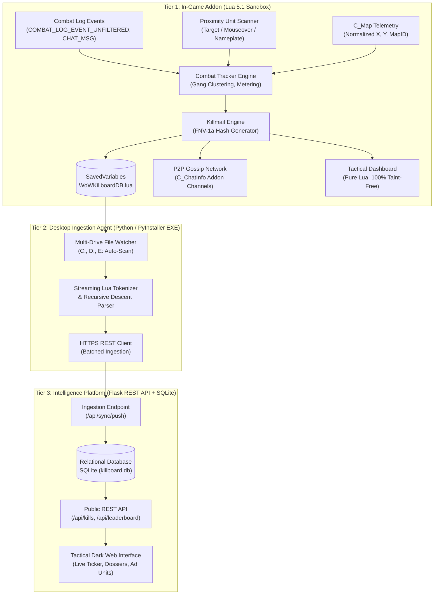

# System Architecture Specification

## 1. Architectural Overview

Because World of Warcraft addons operate in a strictly isolated Lua 5.1 sandbox without raw socket access or outbound HTTP capabilities, the **WoW Killboard** system implements an asynchronous three-tier decoupled pipeline:

---

## 2. Tier Breakdown & Component Specifications

### Tier 1: In-Game Addon (`Addon/WoWKillboard/`)

The in-game addon is a modular Lua package designed to run without third-party libraries (e.g., Ace3) to minimize memory overhead and eliminate vulnerability vectors.

| Module | Purpose | Key Blizzard APIs Utilized |
| :--- | :--- | :--- |
| **`Core.lua`** | Initialization, slash commands (`/kb`), event orchestrator | `ADDON_LOADED`, `PLAYER_LOGIN`, `SLASH_*` |
| **`Config.lua`** | Addon defaults, faction color constants, sound alert IDs | N/A (Static Configuration Table) |
| **`Utils.lua`** | FNV-1a hashing, number/gold formatters, GPS coordinate resolution | `C_Map.GetBestMapForUnit`, `C_Map.GetPlayerMapPosition` |
| **`UnitScanner.lua`** | Proximity level, class, race, and guild cache | `UnitLevel`, `UnitClass`, `UnitRace`, `UnitFactionGroup`, `GetGuildInfo` |
| **`CombatTracker.lua`**| Real-time combat logging, hostile gang clustering, meter aggregation | `COMBAT_LOG_EVENT_UNFILTERED`, `CHAT_MSG_SYSTEM`, `UPDATE_BATTLEFIELD_SCORE` |
| **`Killmail.lua`** | Standardized telemetry generation, chat broadcast, sound triggers | `PlaySound`, `SendChatMessage`, SavedVariables persistence |
| **`BountyEngine.lua`** | Gold escrow, anti-win-trade verification, debtor sirens | `GetMoney`, `SendMail`, proximity nameplate hooks |
| **`Leaderboard.lua`** | In-memory aggregation engine supporting `ALL`, `WORLD`, `BG`, and `DUEL` | Internal Aggregation Tables |
| **`Sync.lua`** | Peer-to-peer gossip protocol over party, raid, and guild channels | `C_ChatInfo.SendAddonMessage`, `CHAT_MSG_ADDON` |
| **`UI.lua`** | High-contrast dark gunmetal dashboard (3 KPI cards, 5 tabs, 4 filter pills) | `CreateFrame("Frame", nil, UIParent, "BackdropTemplate")` |

#### Data Integrity & Cryptographic Hashing
To prevent duplicate records from inflating rankings when multiple group members record the same engagement, each kill is assigned a deterministic 32-bit FNV-1a hash:

$$\text{KillID} = \text{FNV-1a}\left( \text{Timestamp} \parallel \text{KillerGUID} \parallel \text{VictimGUID} \parallel \text{MapID} \parallel \text{CoordX} \parallel \text{CoordY} \right)$$

This hash acts as the primary key across the addon's internal database, the P2P network, and the remote web database.

---

### Tier 2: Desktop Ingestion Agent (`sync/`)

WoW flushes its Lua `SavedVariables` cache to disk when the player reloads the UI (`/reload`), logs out, or exits the game. The Desktop Ingestion Agent bridges the file system to the web tier.

1. **Auto-Discovery Engine**:
   - Automatically iterates common root paths on `C:\`, `D:\`, and `E:\`:
     - `World of Warcraft\_classic_beta_\WTF\Account\`
     - `World of Warcraft\_classic_era_\WTF\Account\`
     - `World of Warcraft\_anniversary_\WTF\Account\`
     - `World of Warcraft\_retail_\WTF\Account\`
   - Locates all `SavedVariables/WoWKillboard.lua` files dynamically.
2. **Streaming Lua Tokenizer**:
   - Custom lexer/parser parses multi-megabyte Lua table dumps without requiring a native Lua runtime.
   - Evaluates nested dictionaries, string escapes, arrays, booleans, and timestamps.
3. **Standalone Distribution**:
   - Compiled with PyInstaller into a self-contained executable (`WoWKillboardSync.exe`).
   - Requires zero Python environment on the player's gaming rig.

---

### Tier 3: Intelligence Platform (`web/`)

A high-performance Flask REST API and responsive dark-mode frontend built with standard web technologies.

1. **Relational Schema (`killboard.db`)**:
   - `kills`: Stores raw killmail documents (killer info, victim info, location, timestamps, mode).
   - `attackers`: Normalized relation tracking individual damage contributions and spell names.
   - `bounties`: Active and fulfilled bounty records.
   - `debt_ledger`: The public Oathbreaker registry recording default amounts and days in default.
   - `character_guild_history`: Historical ledger tracking character guild transfers, memberships, factions, and tenure timestamps (`first_seen`, `last_seen`).
2. **Query & Ranking Engine**:
   - Filter modes: `ALL`, `WORLD`, `BG`, `DUEL`.
   - Aggregated telemetry: Top Killers, Top Victims, Deadliest Zones, Battleground Gladiators (Damage vs Healing).
   - Guild War Intelligence (`GET /api/guilds`, `GET /api/guild/<name>`): Guild K/D rankings, member counts, rosters, and recent guild combat records.
   - Character Intelligence & Armory Integration (`GET /api/character/<name>`): Lifetime combat KPI stats, historical guild timeline, recent kills/deaths, and external Armory links (Blizzard Armory, Classic Ironforge.pro, and Warcraft Logs).
3. **Advertising & Monetization Integration**:
   - High-CPM gaming display containers (NitroPay / Playwire standard units: 728x90, 300x250).
   - "Killboard Pro" role checking to suppress ads and enable gilded profile badges.

