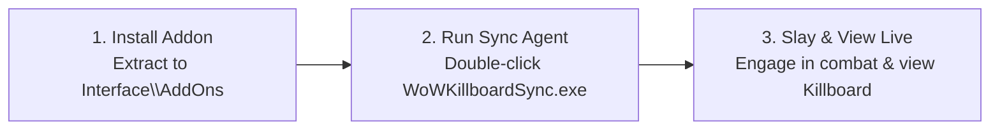

# WoW Killboard — Early Beta Tester Quickstart Guide

Welcome to the **WoW Killboard** Early Beta! This guide gets you up and running in under 2 minutes.

---

## ⚡ Quickstart: 3-Step Setup

### Step 1: Install the In-Game Addon
1. Download **`WoWKillboard-v1.0.0.zip`**.
2. Extract the `WoWKillboard` folder directly into your World of Warcraft AddOns directory:
   - **WoW Forever / Classic Beta**: `World of Warcraft\_classic_beta_\Interface\AddOns\`
   - **Classic Era**: `World of Warcraft\_classic_era_\Interface\AddOns\`
   - **Anniversary**: `World of Warcraft\_anniversary_\Interface\AddOns\`
   - **Modern Retail**: `World of Warcraft\_retail_\Interface\AddOns\`
3. Launch World of Warcraft. On your character selection screen, ensure **WoW Killboard** is checked in the **AddOns** menu.

### Step 2: Launch the Automatic Sync Client (Zero Python Required)
1. Download **`WoWKillboardSync.exe`**.
2. Double-click to launch it.
3. The sync agent automatically discovers your WoW installation across drives `C:`, `D:`, and `E:`.
4. Leave it running in the background while you play. Whenever you `/reload` or log out, your combat kills, Marks of Spite, and battle statistics are instantly synchronized to the realm killboard!

### Step 3: Slay & Track Live
- In-Game Commands:
  - Click the **PvP Skull Minimap Button** (or type `/wowkb` or `/killboard`) to open the **Frontline War Room Dashboard**.
  - **Right-click the Minimap Button** to toggle between **Classic WoW** and **ElvUI Minimalist** visual themes!
  - Slay an enemy player in open world, duels, or battlegrounds to trigger the **Frontline Kill Banner** on your screen.
  - Sound the War Horn with `/warhorn` or `/kbsos` to rally your guild and party when overwhelmed.
- View the Web Killboard:
  - Open the live web portal in your browser to inspect the **Tactical Intel Feed**, **Hall of Legends**, **Marks of Spite**, and **Character Dossiers**.

---

## 🎮 In-Game Controls & Chat Commands

| Command | Action |
| :--- | :--- |
| `/killboard` or `/wowkb` | Toggle the War Room Dashboard |
| `/killboard alerts` or `/wowkb alerts` | Open Frontline Combat Alerts & Radar Settings (or click `⚙️ Alerts` in header) |
| `/killboard move` or `/wowkb move` | Unlock/lock Kill Banner to drag and reposition anywhere on screen |
| `/killboard test` or `/wowkb test` | Fire preview Kill Banner with sound and raid warning |
| `/killboard theme` | Toggle between Classic WoW and ElvUI Minimalist themes |
| `/armory [Name]` | Inspect detailed combat dossier for any combatant |
| `/kb profile [Name]` | Copy web profile dossier URL for yourself or target |
| `/kb claim <code>` | Verify character ownership token from web platform |
| `/spot` or `/scout` | Broadcast enemy sighting with coordinates to allies |
| `/warhorn` or `/kbsos` | Trigger Call to Arms SOS emergency rally beacon |
| `/warhorn stop` | Stand down active War Horn muster |
| `/killboard kos` | Review or manage realm KOS Blacklist |
| `/killboard bounty` | Issue a Mark of Spite on an enemy target |
| `/kb testkill` | Simulate an open-world PvP kill to test your feed & banner |
| `/kb stress [N]` | Simulate N (default 25) combat encounters to benchmark FPS and memory |
| `/kb reset` | Reset local battle history and cached realm totals to 0 |
| `/kb bug [text]` or `/kb report` | Submit instant in-game bug report to AI Diagnostician |

> [!TIP]
> You can also reset your local database anytime with 1 click: open `/kb` &rarr; click **`Settings`** &rarr; scroll to **`5. Database Management`** &rarr; click **`[Reset Local Database]`**!

---

## 🛠️ Frequently Asked Questions & Troubleshooting

### Q: Does the desktop sync require Python installed?
**No.** `WoWKillboardSync.exe` is a standalone, self-contained Windows binary. No Python, terminal, or environment setup is needed.

### Q: Why didn't my kill immediately appear on the web platform?
World of Warcraft only writes `SavedVariables` to disk when you **log out**, **exit the game**, or type **`/reload`**. Simply type `/reload` after a battle to push your kills immediately to the server.

### Q: Will this addon cause UI lag or taint during raid / combat?
**Zero.** WoW Killboard is engineered under strict **Zero Blizzard UI Taint** guardrails:
- Pure Lua widgets with `BackdropTemplate` (zero XML templates).
- Zero `UISpecialFrames` global table pollution.
- Strict `InCombatLockdown()` gating on all frame modifications.
- Pre-allocated Kill Banner frames requiring zero memory allocation in combat.

---

## 💬 Beta Feedback & Automated AI Bug Reporting
Found an issue, interface anomaly, or combat discrepancy?
- **In-Game (Instant AI Diagnosis)**: Click the **`[Report Bug]`** button in the addon header bar, or type `/kb bug [details]`. Your telemetry and description will be captured and analyzed by our Automated AI Diagnostician!
- **Web Platform**: Review active tickets, root-cause analyses, and suggested surgical fixes under **Field Bug Dispatches** in the web footer.
- **Direct Feedback**: Send questions or suggestions directly to **Dagariane**.
