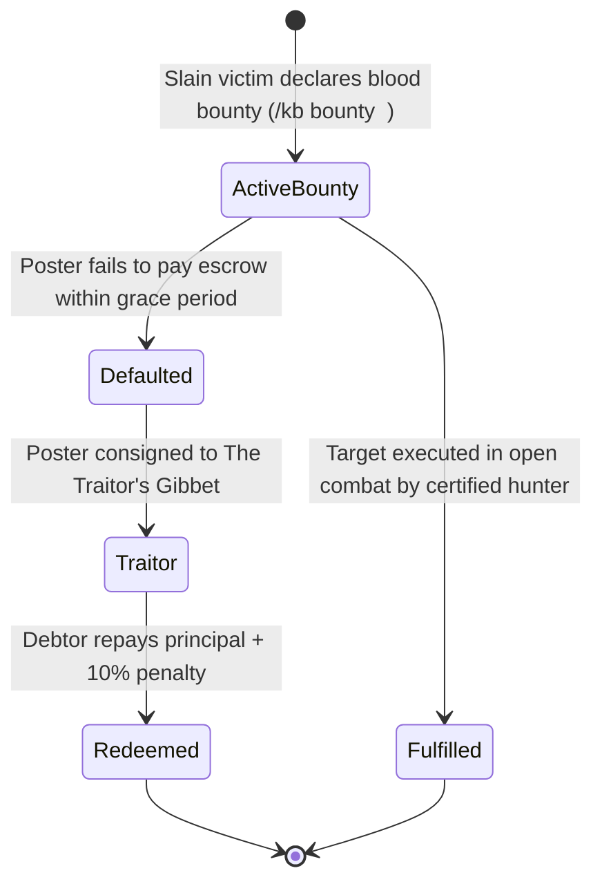
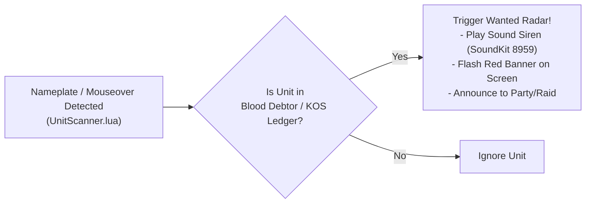

# Blood Bounties & Marks of Spite — Execution Contracts & The Traitor's Gibbet

## 1. The Blood Bounty & Mark of Spite Ecosystem

The WoW Killboard bounty system—formally designated as **Marks of Spite** across the realm High Command—brings real player-driven economic assassination contracts to Azeroth, steeped in the brutal wartime rivalry between the Alliance and the Horde, complete with anti-fraud safeguards, strict open-world battleground gating, and automated debt enforcement.



---

## 2. Strict Open-World PvP Gating (Zero Instance Taint)

To preserve the tactical sanctity of instanced play and focus player bounties on raw open-world warfare:

1. **Open-World Enforcement**:
   - Blood bounties can **strictly only be declared in the open world**.
   - The addon inspects `IsInInstance()`: if the player is currently inside a dungeon (`"party"`), raid (`"raid"`), battleground (`"pvp"`), or arena (`"arena"`), bounty creation is immediately rejected:
     ```text
     "Blood bounties can only be declared upon the open battlefields of Azeroth (Open World PvP only)."
     ```
2. **Death Revenge Gating**:
   - The on-screen revenge prompt (`FALLEN IN BATTLE — DECLARE BLOOD BOUNTY`) is suppressed if the player falls inside an instance, battleground, or arena.
3. **Ingestion & REST API Security**:
   - Ingestion endpoints (`POST /api/bounties`) evaluate the incoming context payload:
     ```python
     if data.get("is_instance") or data.get("battleground"):
         return jsonify({"error": "Blood bounties can only be declared in Open World PvP."}), 400
     ```

---

## 3. Anti-Win-Trade & Anti-Exploit Rules

To prevent players from laundering gold or colluding with friends to collect fake bounties, [`BountyEngine.lua`](../Addon/WoWKillboard/BountyEngine.lua) enforces strict validation heuristics:

1. **Self-Bounty Prohibition**: A player cannot place a bounty on themselves or members of their own active party/raid.
2. **Guild Collusion Filter**: Kills where the killer and victim share the same guild are disqualified from bounty payouts.
3. **Level Disparity Ceiling**:
   - Victims must be within an honorable level threshold of the hunter ($\Delta \text{Level} \le 7$ or grey level threshold).
   - Low-level "grief farming" for bounties is blocked.
4. **Duplicate Kill Cooldown**:
   - Multiple kills of the same victim by the same hunter within a 1-hour window yield no additional bounty payout.
5. **Liquid Gold Verification**:
   - Placing a bounty checks local player funds (`GetMoney()`) before broadcasting the contract.

---

## 4. The Blood Debtor State Machine (Defaulted Debts & Realm KOS Enforcement)

In a single-realm world, reputation is everything. A player may be the realm's fiercest outlaw, but failing to honor financial obligations marks them as a **Blood Debtor** (colloquially known as a **Debt Welcher**).

### State Transitions & Automated KOS Consignment
1. **Active Default**: When a promised bounty payout goes unpaid, the contract enters default status. The player is branded a **Blood Debtor**.
2. **Automated KOS Blacklist Consignment**:
   - The debtor is immediately and automatically inserted into the **Realm KOS Blacklist** (`kos_blacklist`).
   - Any player on the realm—regardless of faction or guild—is authorized to execute the debtor on sight without honor penalties.
3. **Immutable GUID Tracking (Anti-Evasion)**:
   - Debt records are permanently anchored to the combatant's immutable character GUID (`Player-XXXX-XXXXXXXX`).
   - If a debtor changes their character name or transfers between guilds (`/gquit` -> new guild), the ingestion engine detects their GUID on any combat log event or recon sighting, automatically updating their active name and keeping their KOS status active.
4. **P2P & Web Propagation**:
   - Addon broadcasts the debt status across party, raid, and guild channels using `Sync.lua`.
   - The desktop watcher synchronizes the debt record to the web platform's **Wall of Shame — Realm Blood Debtors** ledger.

---

## 5. Proximity Wanted Debtor Radar

The addon maintains an active proximity radar hooked into nameplate creation and mouseover events:



### In-Game Alarm Execution
- **Visual Alert**: Flashes a high-visibility warning banner:
  ```text
  [!] WANTED BLOOD DEBTOR DETECTED: <PlayerName> [Debt: 500g | KOS] [!]
  ```
- **Auditory Alert**: Triggers a distinctive raid siren sound kit (`PlaySound(8959)`).

---

## 6. Redemption & Debt Clearance Workflow

Debtors can clear their name and restore their reputation via debt repayment (`POST /api/debt/pay`):

1. **Administrative Surcharge**: Repaying a defaulted debt requires paying the principal plus a **10% administrative fee** (e.g., a 500g default costs 550g to redeem).
2. **Automated Postal Payment**:
   - When the debtor targets a mailbox, the addon auto-fills a C.O.D. or gold-attached payment letter addressed to the creditor.
3. **Receipt Generation & KOS Cleansing**:
   - Once settled, the debt record is marked as `REDEEMED`.
   - The debtor is **automatically cleansed and removed from the Realm KOS Blacklist**.
   - Their character profile reputation is restored to `HONORABLE COMBATANT` (Debt-Free).
   - The web platform moves the record from the active Wall of Shame to the Historical Redemption Archive.

---

## 7. Bounty Hall of Fame & Supporter Subzone Recon

### 4-Card Bounty Records Grid
The platform automatically aggregates real-time bounty metrics into four distinct Hall of Fame leaderboards (`GET /api/bounties/leaderboards`):
1. **🎯 Top Bounty Hunters**: Ranked by total contracts successfully claimed and total gold bounty rewards earned.
2. **💰 Highest Bounty Contracts**: Ranked by highest escrowed reward amounts.
3. **⏳ Most Elusive Outlaws**: Ranked by survival duration under active bounty contracts without falling.
4. **⚡ Fastest Collected Manhunts**: Record execution times measuring the interval from contract creation to confirmed target slaying.

### Vicinity Recon & Tiered Supporter Access
To guarantee fair play and prevent stream-sniping or targeted harassment:
- **Public / Free Tier**: Displays confirmed combat **Zone** only (e.g. `Last Sighted: Stranglethorn Vale ~14m ago`).
- **Supporter Perk**: Unlocks exact **Subzone** intelligence (e.g. `Booty Bay`) as a quality-of-life benefit for community supporters and realm patrons.
- **100% Ad-Free Experience**: The platform contains zero third-party commercial advertisements, operating entirely through player and guild contributions.

---

## 8. In-Game Death Revenge Prompt & Combat Lockdown Gating

When a player is slain in open-world PvP combat by an enemy player, the addon automatically triggers a vengeance bounty declaration modal:
- **Dialog Appearance**: `"FALLEN IN BATTLE — DECLARE BLOOD BOUNTY"` with a customizable gold input box and `[ Place Bounty ]` / `[ Decline ]` buttons.
- **Strict World-Only Gating**: Only triggers if `IsInInstance()` is false and neither `isBattleground` nor `isArena` is active.
- **Combat Lockdown Protection**: In accordance with Guardrail 1 (Zero Blizzard UI Taint), frame creation and interaction are gated:
  ```lua
  if InCombatLockdown() then
      CT.PendingDeathBounty = killerData
      return
  end
  ```
  If the player dies while in combat lockdown, the prompt is safely deferred and rendered upon `PLAYER_REGEN_ENABLED`.

---

## 9. Anti-Name Change Evasion via Character GUID

To prevent outlaws from racking up large bounties and evading contracts by purchasing a character name change:
- Every bounty contract records the immutable character `targetGUID` (`Player-XXXX-XXXXXXXX`).
- Ingestion and tracking routines inspect both character name and GUID:
  ```sql
  UPDATE bounties SET target_name = ? WHERE target_guid = ? AND target_name != ?;
  ```
  If a player renames their character, the permanent GUID immediately updates the active contract to their new name.

---

## 10. Contract Acceptance & Killing Blow Exclusivity

To collect a bounty reward:
1. **Contract Acceptance Required**: The hunter must explicitly accept the bounty contract beforehand (either via the in-game UI `[ Accept Contract ]` or via the web platform `POST /api/bounties/accept`).
2. **Addon Requirement**: Players without the addon cannot claim bounty rewards because they never accepted the contract.
3. **Certified Killing Blow**: In group combats or gang encounters, only the single hunter who delivers the certified final killing blow claims the bounty reward.

---

## 11. Archive of Unclaimed Bounties (>30 Days)

Bounties remaining active and unclaimed for more than 30 days are automatically archived:
- Status transitions from `ACTIVE` to `COLD_CASE`.
- Archived contracts are cataloged in a dedicated Archive of Unclaimed Bounties tab in both the addon and web platform, preventing backlog clutter while preserving historical outlaw records.

---

## 12. High Command Execution List & Intel Web Layout

The web platform features an authentic High Command Execution List showcase:
- **Top 10 Outlaw Gallery**: Top 10 active bounties displayed as high-contrast wanted posters with class portraits, faction crests, blood rewards, and last-seen zone telemetry.
- **Permanent Showcase**: Always accessible on the primary Intel feed with certified contract tracking.
- **Intel Stream**: Real-time killmail stream positioned directly beneath the Execution List cards.
- **War Council Sidebar Intelligence**: 7-day rolling activity metrics, top vanguard champions, top war guilds, top classes, and conflict zones alongside official Armory links.

---

## 13. Head-to-Head Blood Feuds & Rules of Engagement (ROE)

To settle bitter faction rivalries and guild grudges without handling or escrowing gold:

1. **Contest Declaration**:
   - Guild Masters and combatants can declare a Head-to-Head Blood Feud via `/api/feuds/challenge` or the web platform (`⚔️ Declare Blood Feud`).
   - Contests set a race to $N$ kills (e.g., first to 100 kills) over a 30-day duration.
2. **Rules of Engagement (ROE) Enforcement**:
   - **Anti-Lowbie Floor**: Victims below the minimum level threshold (e.g. Level 55+) award 0 points, eliminating low-level grief farming.
   - **Underdog Multiplier**: Solo combatants prevailing over outnumbered hostile squads (1v2, 1v3) receive double points (2 points per victory).
   - **Anti-Zerg Filter**: Cheap zerg ganks (3+ attackers on a lone target) yield 0 points under ROE.
   - **Zone Boundaries**: Contests can optionally be restricted to specific theaters (e.g. Stranglethorn Vale).
3. **Deciding Blow & Consequence**:
   - The first entity to reach the target score wins the feud.
   - The losing entity is automatically consigned to the **Realm KOS Blacklist**.

---

## 14. Zero-Gold Stakes & The Realm KOS Blacklist

Rather than handling gold bets or custody, defeat carries lasting faction consequences:
- **Consignment to KOS**: Defeated guilds and disgraced gankers are permanently branded onto the public Realm KOS Blacklist (`kos_blacklist`).
- **In-Game Target Acquisition**: The addon proximity scanner flags blacklisted guild members instantly upon mouseover or target acquisition, sounding an air-raid siren (`PlaySound(8959)`) and rendering an alert dialog (`UI:ShowKOSAlert`).

---

## 15. 30-Day Anti-Guild-Hop Deserter Stain

To prevent members of a defeated guild from dodging public retribution by using `/gquit` or jumping to an alt guild:
- **Automated Roster Stamping**: When a guild is blacklisted, all known member character GUIDs are recorded in `kos_deserters` with a 30-day penance expiration (`expires_at = now + 30 * 86400`).
- **Permanent GUID Tracking**: The stain attaches to the character's internal Blizzard `Player-GUID`. Even if they switch guilds or rename, their deserter mark persists.
- **Proximity Deserter Sirens**: When a marked deserter enters range, in-game proximity alerts announce:
  ```text
  [🚨 KOS DESERTER DETECTED] CharacterName (Ex-Guild: <DefeatedGuild>) - SERVING 30-DAY DESERTER PENANCE! KILL ON SIGHT!
  ```

---

## 16. Tactical Intel & Gank Sighting Recon Wire

Allows scouts and field commanders to report hostile sightings in real time:
- **In-Game Recon Command**: `/spot [notes]`, `/scout [notes]`, or `/kb spot` captures target name, class, level, guild, faction, and normalized GPS coordinates.
- **P2P Wire**: Immediately broadcasts sightings across Guild chat (`/g`), Party/Raid (`/p`, `/ra`), and peer-to-peer addon message channels (`SPT:` protocol via `Sync.lua`).
- **Live Web Wire & Discord Embeds**: Real-time tactical reconnaissance ticker (`#intel-sighting-wire`) with 6-second polling updates and Discord Webhook integration.


