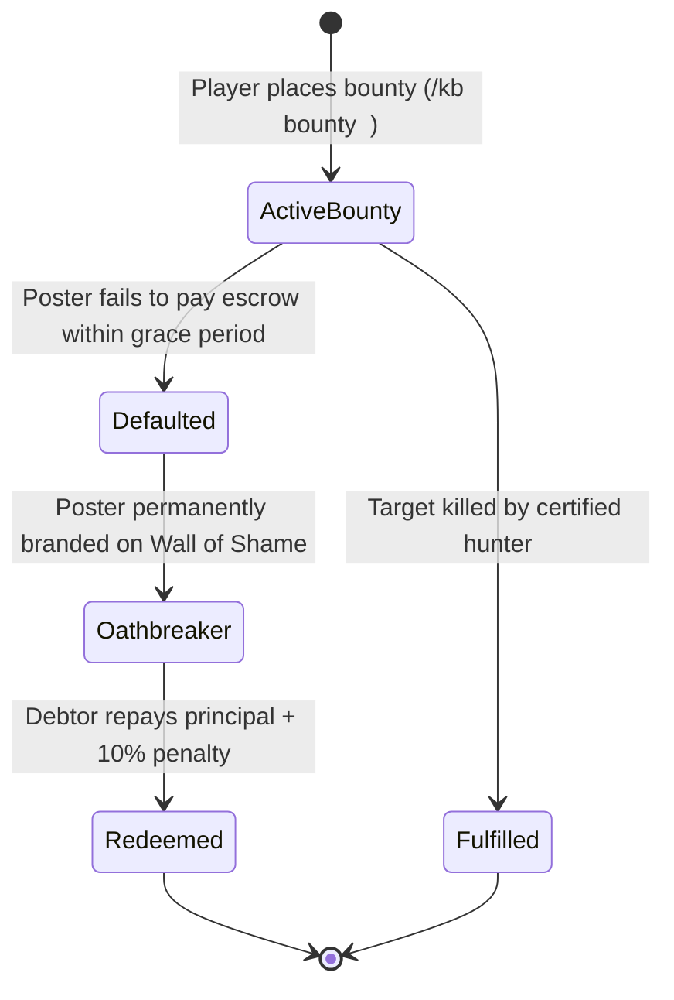
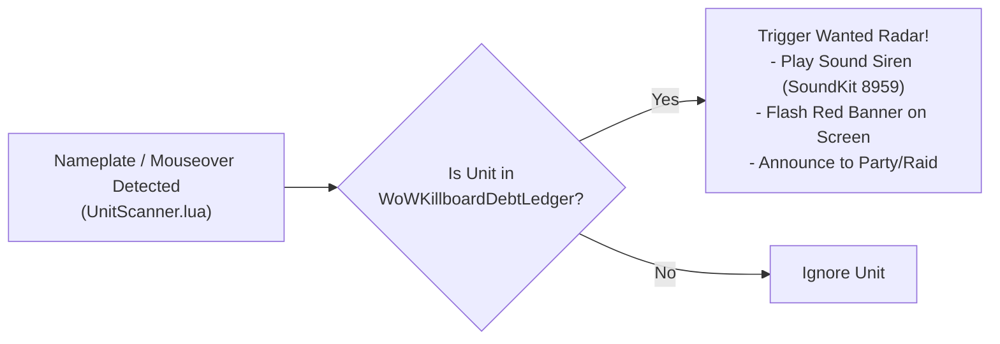

# Bounty Escrow & Oathbreaker Debt Ledger

## 1. The Bounty Ecosystem

The WoW Killboard bounty system brings real player-driven economic assassination contracts to Azeroth, complete with anti-fraud safeguards and automated debt enforcement.



---

## 2. Anti-Win-Trade & Anti-Exploit Rules

To prevent players from laundering gold or colluding with friends to collect fake bounties, [`BountyEngine.lua`](file:///c:/Users/SQUICK/WoW_Killboard/Addon/WoWKillboard/BountyEngine.lua) enforces strict validation heuristics:

1. **Self-Bounty Prohibition**: A player cannot place a bounty on themselves or members of their own active party/raid.
2. **Guild Collusion Filter**: Kills where the killer and victim share the same guild are disqualified from bounty payouts.
3. **Level Disparity Ceiling**:
   - Victims must be within an honorable level threshold of the hunter ($\Delta \text{Level} \le 7$ or grey level threshold).
   - Low-level "grief farming" for bounties is blocked.
4. **Duplicate Kill Cooldown**:
   - Multiple kills of the same victim by the same hunter within a 1-hour window yield no additional bounty payout.
5. **Liquid Gold Verification**:
   - Placing a bounty checks local player funds (`GetMoney()`) before broadcasting the contract.

---

## 3. The Oathbreaker Debt State Machine & "Wall of Shame"

When a player promises a bounty payout or participates in an escrow contract that goes unfulfilled, their record transitions to default:

### State Transitions
1. **Active Default**: The contract enters default status. The poster is designated an **Oathbreaker**.
2. **P2P & Web Propagation**:
   - Addon broadcasts the debt status across party, raid, and guild channels using `Sync.lua`.
   - The desktop watcher pushes the debt record to the web platform's **Wall of Shame** ledger.
3. **Public Stigmatization**:
   - The debtor's name, defaulted gold amount, and timestamp are displayed on the public web ledger and in-game Bounties tab.

---

## 4. Proximity Wanted Debtor Radar

The addon maintains an active proximity radar hooked into nameplate creation and mouseover events:



### In-Game Alarm Execution
- **Visual Alert**: Flashes a high-visibility warning banner:
  ```text
  [!] WANTED OATHBREAKER DETECTED: <PlayerName> [Debt: 500g] [!]
  ```
- **Auditory Alert**: Triggers a distinctive raid siren sound kit (`PlaySound(8959)`).

---

## 5. Redemption & Debt Clearance Workflow

Debtors can clear their name and restore their reputation via the in-game Redemption Portal:

1. **Administrative Surcharge**: Repaying a defaulted debt requires paying the principal plus a **10% administrative fee** (e.g., a 500g default costs 550g to redeem).
2. **Automated Postal Payment**:
   - When the debtor targets a mailbox, the addon auto-fills a C.O.D. or gold-attached payment letter addressed to the creditor.
3. **Receipt Generation**:
   - Once mailed, the local debt record is updated to `PAID`.
   - P2P sync broadcasts the clearance across the network.
   - The web platform moves the record from the active Wall of Shame to the Historical Redemption Archive.

---

## 6. Bounty Hall of Fame & Supporter Subzone Recon

### 4-Card Bounty Records Grid
The platform automatically aggregates real-time bounty metrics into four distinct Hall of Fame leaderboards (`GET /api/bounties/leaderboards`):
1. **🎯 Top Bounty Hunters**: Ranked by total contracts successfully claimed and total gold bounty rewards earned.
2. **💰 Highest Bounty Contracts**: Ranked by highest escrowed reward amounts.
3. **⏳ Most Elusive Outlaws**: Ranked by survival duration under active bounty contracts without falling.
4. **⚡ Fastest Collected Manhunts**: Record execution times measuring the interval from contract creation to confirmed target slaying.

### Vicinity Recon & Tiered Supporter Access
To guarantee fair play and prevent stream-sniping or targeted harassment:
- **Public / Free Tier**: Displays confirmed combat **Zone** only (e.g. `Last Sighted: Stranglethorn Vale ~14m ago`).
- **Supporter Perk**: Unlocks exact **Subzone** intelligence (e.g. `Booty Bay`) as a quality-of-life benefit for supporters of **Forged By Valor (501(c)(3))**.
- **100% Ad-Free Experience**: The platform contains zero third-party commercial advertisements, operating entirely through community and non-profit veteran support.

---

## 7. In-Game Death Bounty Prompt & Combat Lockdown Gating

When a player is slain in PvP combat by an enemy player, the addon automatically triggers a bounty placement modal:
- **Dialog Appearance**: `"[Killer] has killed you. Would you like to place a bounty?"` with a customizable gold input box and `[ Place Bounty ]` / `[ Decline ]` buttons.
- **Combat Lockdown Protection**: In accordance with Guardrail 1 (Zero Blizzard UI Taint), frame creation and interaction are gated:
  ```lua
  if InCombatLockdown() then
      CT.PendingDeathBounty = killerData
      return
  end
  ```
  If the player dies while in combat lockdown, the prompt is safely deferred and rendered upon `PLAYER_REGEN_ENABLED`.

---

## 8. Anti-Name Change Evasion via Character GUID

To prevent outlaws from racking up large bounties and evading contracts by purchasing a character name change:
- Every bounty contract records the immutable character `targetGUID` (`Player-XXXX-XXXXXXXX`).
- Ingestion and tracking routines inspect both character name and GUID:
  ```sql
  UPDATE bounties SET target_name = ? WHERE target_guid = ? AND target_name != ?;
  ```
  If a player renames their character, the permanent GUID immediately updates the active contract to their new name.

---

## 9. Contract Acceptance & Killing Blow Exclusivity

To collect a bounty reward:
1. **Contract Acceptance Required**: The hunter must explicitly accept the bounty contract beforehand (either via the in-game UI `[ Accept Contract ]` or via the web platform `POST /api/bounties/accept`).
2. **Addon Requirement**: Players without the addon cannot claim bounty rewards because they never accepted the contract.
3. **Certified Killing Blow**: In group combats or gang encounters, only the single hunter who delivers the certified final killing blow claims the bounty reward.

---

## 10. Cold Cases Archival (>30 Days)

Bounties remaining active and unclaimed for more than 30 days are automatically archived:
- Status transitions from `ACTIVE` to `COLD_CASE`.
- Cold cases are cataloged in a dedicated Cold Cases Archive view in both the addon and web platform, preventing backlog clutter while preserving historical outlaw records.

---

## 11. FBI Most Wanted Web Showcase & zKillboard Layout

The web platform features an authentic FBI Most Wanted showcase:
- **Top 10 Outlaw Gallery**: Top 10 active bounties displayed as high-contrast wanted posters with class portraits, faction badges, bounty rewards, and last-seen zone telemetry.
- **Opt-In Bounty Hunter Mode**: Players who prefer standard leaderboards can toggle Bounty Hunter Mode ON/OFF at any time to collapse the wanted cards.
- **Most Recent Kills Feed**: Real-time killmail stream positioned directly beneath the Most Wanted cards.
- **zKillboard Sidebar Intelligence**: 7-day rolling activity metrics, top characters, top guilds, top classes, and hotspot zones alongside official Armory links.

