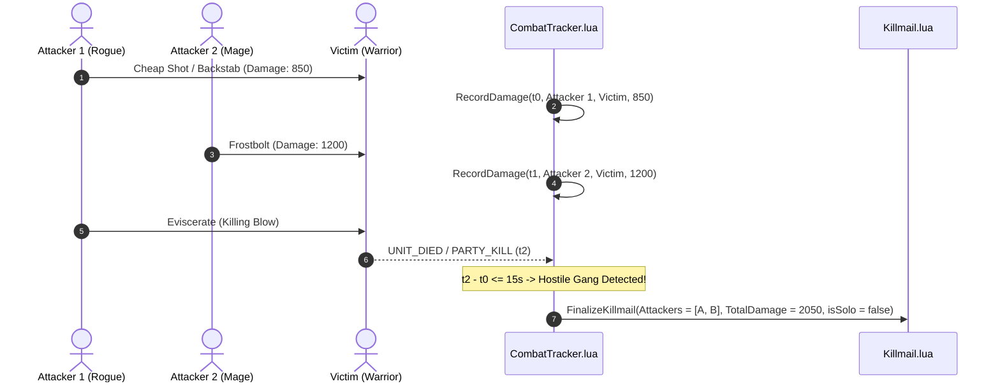

# Combat Telemetry & Gang Clustering Engine

## 1. Combat Log Interception Pipeline

The heart of the WoW Killboard addon is [`CombatTracker.lua`](file:///c:/Users/SQUICK/WoW_Killboard/Addon/WoWKillboard/CombatTracker.lua), which listens to low-level client combat events and translates them into structured combat telemetry.

### Cross-Client Event Architecture
In modern WoW (Retail 11.x), Blizzard altered `COMBAT_LOG_EVENT_UNFILTERED` to avoid payload exploitation, whereas Classic (1.15.x / WoW Forever Beta / Era) relies on `CombatLogGetCurrentEventInfo()`.

The engine dynamically detects the execution environment at load time:
```lua
local isModernClient = (type(CombatLogGetCurrentEventInfo) ~= "function")
```
- **Classic / Era / Forever Beta**: Hooks `COMBAT_LOG_EVENT_UNFILTERED` and unpacks sub-events via `CombatLogGetCurrentEventInfo()`.
- **Damage Sub-events**: Intercepts `SWING_DAMAGE`, `RANGE_DAMAGE`, `SPELL_DAMAGE`, `SPELL_PERIODIC_DAMAGE`.
- **Healing Sub-events**: Intercepts `SPELL_HEAL`, `SPELL_PERIODIC_HEAL`.
- **Termination Events**: Listens to `PARTY_KILL` and `UNIT_DIED`.
- **Honorable Kill Verification**: Correlates damage logs with `CHAT_MSG_COMBAT_HONOR_GAIN` to verify non-trivial PvP honor rewards.

---

## 2. Temporal Hostile Gang Clustering Algorithm

In open world PvP and Battlegrounds, simple kill credits do not accurately convey the tactical nature of an engagement (e.g., was it a fair 1v1 duel or a 5-man gank squad?).

WoW Killboard implements a **15-second sliding temporal clustering algorithm**:



### Mathematical Clustering Rules
1. **Sliding Window ($\Delta t \le 15\text{s}$)**: Any hostile combatant dealing damage to the victim within 15 seconds preceding death is added to the engagement cluster.
2. **Solo Kill Certification**: An engagement is marked `isSolo = true` if and only if:
   - Exactly one unique attacker exists in the cluster ($\text{Count}(\text{Attackers}) = 1$).
   - The player's friendly party size was 1 (`GetNumGroupMembers() == 0`).
   - The victim had no concurrent assists.
3. **Contribution Metering**: Each attacker's absolute damage and primary attack spell are recorded and displayed in the killmail dossier.

---

## 3. 1v1 Duel Detection System

Unlike open world PvP, duels end without player death. Players are knocked out to 1 HP or forfeit by leaving the duel boundary.

### Chat System Interception
The engine registers `CHAT_MSG_SYSTEM` and filters for localized regex patterns:
- **Victory Pattern**: `DUEL_WINNER_KNOCKOUT` (`"(.+) has defeated (.+) in a duel"`)
- **Forfeit Pattern**: `DUEL_WINNER_FLEE` (`"(.+) has fled from (.+) in a duel"`)

### Telemetry Pipeline
1. When a duel completes, `OnDuelCompleted(winner, loser, isFlee)` is invoked.
2. Local player participation is verified:
   - If `winner == playerName`: `WoWKillboardDB.stats.duels.wins` increments.
   - If `loser == playerName`: `WoWKillboardDB.stats.duels.losses` increments.
3. A certified duel killmail is minted:
   - `isDuel = true`
   - `isSolo = true`
   - `battlegroundName = "Duel (Knockout)"` or `"Duel (Forfeit)"`
   - Location GPS coordinates are tagged to record the duel grounds.

---

## 4. Battleground Telemetry Engine

In instanced Battlegrounds (Warsong Gulch, Arathi Basin, Alterac Valley), scoreboard analytics and faction victory outcomes are synchronized via `UPDATE_BATTLEFIELD_SCORE` and `PVP_MATCH_COMPLETE`.

### Scoreboard Data Extraction
1. Polls `GetNumBattlefieldScores()` and `GetBattlefieldScore(index)`.
2. Matches the player's unit name against score records to track:
   - **Damage Done**
   - **Healing Done**
   - **Killing Blows**
   - **Honorable Kills**
3. Records match outcomes:
   - Hooks `GetBattlefieldWinner()` (returns `0` for Horde, `1` for Alliance).
   - Validates using type-safe comparison:
     ```lua
     local isWin = (tonumber(winner) == pFactionIndex) or (tostring(winner) == tostring(pFaction))
     ```
   - Increments `WoWKillboardDB.stats.bgs.wins` or `WoWKillboardDB.stats.bgs.losses`.

---

## 5. Map & GPS Coordinate Tracking

Every killmail captures high-precision spatial coordinates using Blizzard's `C_Map` API:
```lua
local mapID = C_Map.GetBestMapForUnit("player")
if mapID then
    local pos = C_Map.GetPlayerMapPosition(mapID, "player")
    if pos then
        x = pos.x * 100
        y = pos.y * 100
    end
end
```
These coordinates allow the web platform and in-game Zone Intel engine to calculate conflict heatmaps and pinpoint high-lethality choke points across Azeroth.
