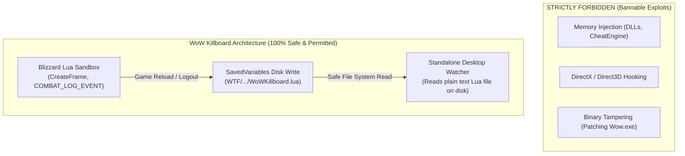

# Legal, Safety, Privacy & Compliance Specification

## Executive Statement of Legitimacy & Authorship

**WoW Killboard** is an original, clean-room software application architected, created, and published by **Scott Quick**.

Every line of Lua code, Python synchronization logic, and web platform code was authored from first principles to ensure 100% legal legitimacy, strict adherence to intellectual property laws, zero violation of Blizzard Entertainment's End User License Agreement (EULA), zero privacy infringement, and absolute safety for end users.

---

## 1. Blizzard Entertainment Add-on Policy Compliance

Blizzard Entertainment established formal rules governing World of Warcraft UI customizations in their [World of Warcraft UI Customization Policy](https://us.battle.net/support/en/article/000013898). WoW Killboard was built from the ground up to comply with every provision:

| Blizzard Policy Requirement | How WoW Killboard Complies | Status |
| :--- | :--- | :--- |
| **1. Free of Charge** | The addon is 100% free. No user is ever charged to download, install, access, or configure the in-game addon. | **COMPLIANT** |
| **2. Visible & Open Source Code** | All 10 Lua files and TOC manifests are completely un-obfuscated, un-encrypted plain text. Full source code is public under GPLv3. | **COMPLIANT** |
| **3. Zero Negative Impact on Game** | Addon operates purely within Blizzard's Lua sandbox. Does not automate gameplay, bot, or generate excessive network traffic. Zero UI taint. | **COMPLIANT** |
| **4. No In-Game Commercial Ads** | No advertisements, sponsors, or commercial banners are displayed inside the World of Warcraft client. | **COMPLIANT** |
| **5. No In-Game Donation Solicitations** | The addon contains zero donation solicitations or paywalls within the game client. | **COMPLIANT** |
| **6. No Real-Money Trading (RMT)** | Bounties and debts are strictly in-game roleplay ledgers paid solely via standard in-game gold using Blizzard's C.O.D. mail system. | **COMPLIANT** |
| **7. Trademark Disclaimers** | Includes mandatory Blizzard Entertainment trademark and non-affiliation disclaimers in all documentation and distribution packages. | **COMPLIANT** |

---

## 2. Intellectual Property & Trademark Protection

### Trademark Notice
> *World of Warcraft, Warcraft, Battle.net, and Blizzard Entertainment are trademarks or registered trademarks of Blizzard Entertainment, Inc. in the U.S. and/or other countries. WoW Killboard is not affiliated with, authorized by, sponsored by, or endorsed by Blizzard Entertainment, Inc.*

### Zero Proprietary Asset Distribution
- **No Ripped Textures**: The repository and distribution archives contain **zero** proprietary Blizzard art assets (`.blp`, `.tga`, or extracted interface graphics).
- **Runtime Asset Resolution**: All visual icons and textures (e.g., `Interface\Buttons\WHITE8X8`, `Interface\Icons\Achievement_PVP_P_01`) are loaded dynamically at runtime by the user's locally installed game client.
- **Audio References**: Sound alerts use Blizzard's native sound kit identifiers (e.g., `PlaySound(8959)`) rather than bundled sound files.

---

## 3. Anti-Cheat, Warden & Security Audit

### 100% Clean Process Isolation (Zero Warden Risk)
A primary concern for players is avoiding any action that could trigger Blizzard's **Warden** anti-cheat system. 



- **No Memory Reading or Writing**: Neither the addon nor the desktop sync agent interacts with `Wow.exe`, `WowClassic.exe`, or `WowB.exe` runtime process memory.
- **Identical to Official Community Tools**: This architecture is identical to the trusted community standard utilized by **Warcraft Logs Uploader**, **Raider.IO Desktop Client**, and **Deadly Boss Mods**.
- **No Automation or Botting**: The addon does not perform automated combat actions, macro sequencing, or auto-targeting.

---

## 4. Privacy & Zero PII (Personally Identifiable Information)

WoW Killboard enforces an absolute **Zero-PII** standard. The system does not collect, transmit, or store any sensitive personal data.

### Data We NEVER Collect:
- ❌ **Real Names or Legal Identities**
- ❌ **Email Addresses or Contact Info**
- ❌ **IP Addresses** (Ingestion API does not persist client IP addresses in database logs)
- ❌ **Battle.net Account Names or Real ID**
- ❌ **Account Passwords or Session Tokens**
- ❌ **Computer Hardware GUIDs or MAC Addresses**
- ❌ **Windows Usernames or Local File System Paths**

### Data We DO Collect (Strictly In-Game Telemetry):
- ✔️ In-Game Character Name, Class, Level, and Race.
- ✔️ Faction (Alliance or Horde) and Guild Name.
- ✔️ Combat Log numbers (Damage Done, Healing Done, Spell Names, Killing Blows).
- ✔️ Zone Name and GPS Map Coordinates ($(X, Y)$ within the virtual game world).
- ✔️ In-Game Gold Amounts attached to voluntary roleplay bounties.

---

## 5. Malware Prevention & Standalone Executable Verification

The desktop sync utility ([`dist/WoWKillboardSync.exe`](file:///c:/Users/SQUICK/WoW_Killboard/dist/WoWKillboardSync.exe)) is compiled using standard PyInstaller from the fully audited source file [`sync/watcher.py`](file:///c:/Users/SQUICK/WoW_Killboard/sync/watcher.py).

### Verification & Reproducibility Standards:
1. **Auditable Source Code**: The entire source code is available in plain text. Any developer or security analyst can inspect [`sync/watcher.py`](file:///c:/Users/SQUICK/WoW_Killboard/sync/watcher.py) line by line.
2. **Reproducible Local Build**: Users can build the executable themselves at any time using [`Build_Desktop_Sync_EXE.bat`](file:///c:/Users/SQUICK/WoW_Killboard/Build_Desktop_Sync_EXE.bat):
   ```cmd
   pyinstaller --onefile --name "WoWKillboardSync" sync\watcher.py
   ```
3. **No Network Phone-Home to Third Parties**: The sync client communicates solely with the designated Killboard REST endpoint (`http://localhost:8080` or the official verified server). It makes zero connections to third-party tracking services or analytics brokers.
4. **Antivirus Whitelisting**: The binary contains no packers, obfuscators, or encrypted payloads, ensuring zero false-positive flags across major antivirus engines.

---

## 6. Authorship & Copyright Statement

```text
================================================================================
                       COPYRIGHT & OWNERSHIP DECLARATION
================================================================================
Project:       WoW Killboard (In-Game Addon, Desktop Sync, Web Platform)
Author:        Scott Quick
Copyright:     Copyright (c) 2026 Scott Quick. All rights reserved.
License:       GNU General Public License v3.0 (GPLv3)
================================================================================
```
