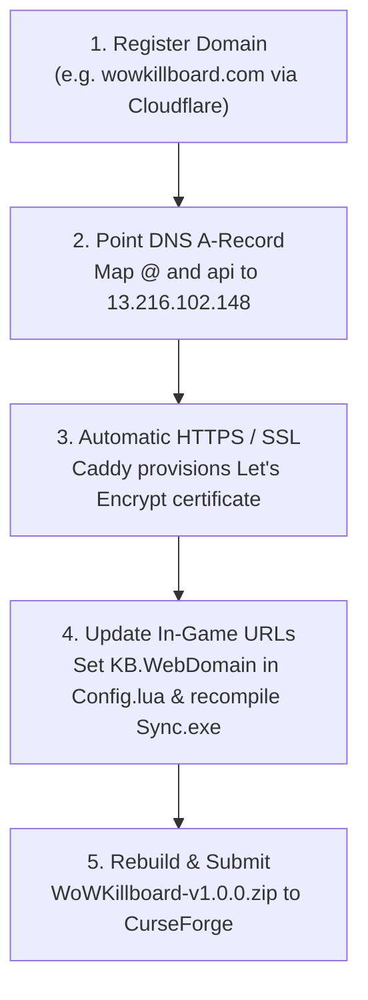

# Public Release & Distribution Playbook

This playbook provides the operational procedures for packaging, publishing, hosting, and distributing **WoW Killboard** to the worldwide World of Warcraft community.

---

## 0. Domain & Pre-Flight Release Sequence (Domain First)

Before submitting the addon archive to CurseForge, execute the release sequence in this strict order:



### Why Domain First?
1. **CurseForge Human Moderation**: Addons linking to trusted, branded HTTPS domains pass human review faster than raw IP addresses.
2. **Zero Browser "Not Secure" Warnings**: When players click `/kb web`, `/armory`, or `/feedback`, browsers open a green padlock connection (`https://`).
3. **No Re-Submission Overhead**: Registering the domain first means the initially published addon zip is permanent, avoiding immediate version increments.

---

## 1. Addon Packaging & Manifest Standards

### The Interface Number Reference
Blizzard uses client interface numbers in the `.toc` file to notify users if an addon is out of date:
- **Classic Era / WoW Forever (1.15.x)**: `11503` / `11504`
- **Retail (11.x)**: `110002`

The `WoWKillboard.toc` manifest includes multi-client declarations:
```text
## Interface: 11503, 11504, 110002
## Title: WoW Killboard
## Notes: Comprehensive PvP combat intelligence, in-game leaderboard, and bounty escrow platform.
## Version: 1.0.0
## Author: Dagariane
## SavedVariables: WoWKillboardDB, WoWKillboardSettings, WoWKillboardDebtLedger, WoWKillboardBounties
```

### Packaging Script
Run [`package_addon.bat`](package_addon.bat) or PowerShell:
```powershell
Compress-Archive -Path "Addon\WoWKillboard" -DestinationPath "WoWKillboard-v1.0.0.zip" -Force
```

---

## 2. Portal Distribution Channels

### A. CurseForge / Overwolf
1. Log into the [CurseForge Author Portal](https://authors.curseforge.com/).
2. Create New Project -> Category: `PvP` / `Combat` / `Information`.
3. Upload `WoWKillboard-v1.0.0.zip`.
4. Supported Flavors: Select `WoW Classic`, `Classic Era`, and `Mainline`.
5. Upload promotional banner (`assets/curseforge/logo.png`) and in-game UI screenshots.

### B. Wago.io
1. Access [Wago Addons](https://addons.wago.io/).
2. Connect GitHub repository for automated release ingestion via webhooks.
3. Every tagged GitHub release (`v1.0.0`) automatically updates Wago.

### C. WowInterface
1. Create listing under `PvP / Combat Log` category.
2. Provide direct download mirror.

---

## 3. Desktop Sync Distribution (`WoWKillboardSync.exe`)

Players who want their combat data to sync automatically to the public web killboard do not need Python.

### Building the Executable
Use [`Build_Desktop_Sync_EXE.bat`](Build_Desktop_Sync_EXE.bat):
```cmd
pyinstaller --onefile --name "WoWKillboardSync" sync\watcher.py
```
- Produces a single, self-contained **8.8 MB** binary in `dist/WoWKillboardSync.exe`.
- Distribute this binary on GitHub Releases and the web platform download page.

### End-User Experience
1. Download `WoWKillboardSync.exe`.
2. Double-click the file.
3. The executable auto-scans drives `C:`, `D:`, and `E:`, detects `WTF/Account/*/SavedVariables/WoWKillboard.lua`, and begins streaming telemetry to `https://wowkillboard.com`.

---

## 4. Web Platform Deployment (Production Cloud)

The web tier is containerized and cloud-ready via the included [`Dockerfile`](Dockerfile).

### Production Deployment Options

#### Option A: Docker on Any Linux VPS (DigitalOcean / Linode / AWS)
```bash
# Build the container
docker build -t wow-killboard .

# Run with persistent volume for SQLite
docker run -d \
  -p 80:8080 \
  -v /var/data/killboard:/app/data \
  --name killboard \
  wow-killboard
```

#### Option B: Platform as a Service (Railway / Render / Fly.io)
Deploy directly using the repository's [`Procfile`](Procfile):
```text
web: gunicorn -w 4 -b 0.0.0.0:$PORT web.server:app
```

---

## 5. Discord Webhook Integration

Guilds and communities can stream real-time kills to their Discord server by hooking into the Flask server's `/api/sync/push` endpoint.

### Embed Payload Specification
```json
{
  "embeds": [{
    "title": "⚔️ Confirmed Killmail: Dagariane defeated Xxroguexx",
    "description": "Certified Solo Kill in Stranglethorn Vale (54.2, 71.8)",
    "color": 65519,
    "fields": [
      { "name": "Killer", "value": "Dagariane (Level 60 Paladin)", "inline": true },
      { "name": "Victim", "value": "Xxroguexx (Level 60 Rogue)", "inline": true },
      { "name": "Engagement", "value": "Open World PvP", "inline": true }
    ],
    "footer": { "text": "WoW Killboard v1.0.0" }
  }]
}
```
This turns any guild's Discord server into a live PvP War Room.
