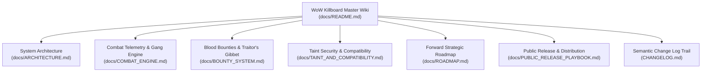

# WoW Killboard — Technical Wiki & Knowledge Base

Welcome to the official developer and operator documentation for **WoW Killboard [Frontline War Room]** — an open-source, enterprise-grade combat telemetry, in-game leaderboard, blood bounty escrow platform, and real-time war intelligence network, capturing the raw, brutal darkness of the Alliance vs. Horde conflict across **World of Warcraft: Forever**, **Classic Era**, **Anniversary**, and **Retail**.

---

## Wiki Navigation & Table of Contents

### Core Architecture & Systems
1. **[System Architecture](ARCHITECTURE.md)**
   - The 3-tier operational model (In-Game Lua Addon, Desktop File Watcher, Web Platform).
   - Data flow pipelines, FNV-1a cryptographic hashing, and state persistence contracts.
   - Streamlined 7-item navigation architecture (`Theater`, `Intel`, `Hall of Legends`, `World Hazards`, `Armory`, `Bounties`, `Warroom`).
   - Class, Spec & Level Cohort Percentile Engine with mathematical standing.

2. **[Combat Telemetry & Gang Clustering Engine](COMBAT_ENGINE.md)**
   - Combat log event parsing across Classic (1.15.x) and Retail (11.x).
   - Sliding 15-second temporal hostile clustering algorithm for Gang vs. Certified Solo kill classification.
   - 1v1 Duel detection (knockouts vs forfeits) and Battleground objective/match scoring.
   - Map coordinate resolution via `C_Map`.

3. **[Blood Bounties & The Traitor's Gibbet](BOUNTY_SYSTEM.md)**
   - Gold blood bounty mechanics and strict open-world PvP gating (`IsInInstance()` protection).
   - The Traitor's Gibbet state machine: default penalties and the public registry of oathbreakers.
   - Wanted Debtor proximity radar with visual alarms and siren audio.
   - 1-click in-game C.O.D. redemption workflow.

4. **[Taint Security & Cross-Client Compatibility](TAINT_AND_COMPATIBILITY.md)**
   - The Zero-Taint Philosophy: eradicating Blizzard XML templates and `UISpecialFrames` pollution.
   - Custom ESC key event propagation (`SetPropagateKeyboardInput`).
   - Cross-Client Compatibility Matrix: WoW Forever Beta (`_classic_beta_`), Classic Era (`_classic_era_`), Anniversary (`_anniversary_`), and Retail (`_retail_`).

5. **[Strategic Forward Roadmap](ROADMAP.md)**
   - Phase 1: Core Engine & Combat Hardening (*Completed*).
   - Phase 2: Desktop Ingestion & Standalone Courier (*Completed*).
   - Phase 3: Guild Wars, Tactical Defense & Discord Network (*Completed*).
   - Phase 4: Competitive Intelligence, HUD & Streamlined Web (*Completed*).
   - Phase 5: Public Release, Cloud Hosting & Multi-Realm Federation (*Active / Next Focus*).

6. **[Public Release & Distribution Playbook](PUBLIC_RELEASE_PLAYBOOK.md)**
   - Addon packaging and deployment automation.
   - Publishing to CurseForge, Wago.io, WowInterface, and GitHub Releases.
   - Standalone Desktop Sync binary compilation with PyInstaller.
   - Production Docker containerization and Discord Webhook integration.

7. **[Stress Testing & Performance Benchmarks](STRESS_TESTING.md)**
   - Comprehensive multi-tier performance load testing and verification protocols.
   - SavedVariables LuaTableParser stress testing (escalating payloads up to 2,500 records at 7,200+ rec/s).
   - In-Game combat burst macro `/kb stress [N]` with microsecond profiling and memory delta analysis.
   - Multi-threaded REST API and SQLite WAL concurrency load testing (150+ RPS with 0 lock errors).

8. **[Dedicated Linux VPS Deployment Runbook](DEPLOYMENT_VPS.md)**
   - Production AWS Lightsail infrastructure setup, Ubuntu 24.04 LTS deployment, and Caddy reverse proxy.
   - Automatic SSL/TLS certificate issuance via Let's Encrypt / ZeroSSL.
   - Remote maintenance, zero-downtime updates, and automated daily backups.

9. **[Beta Tester Quickstart Guide](BETA_TESTER_QUICKSTART.md)**
   - 2-minute setup instructions for community players and guild officers.
   - Complete in-game command cheat-sheet, minimap controls, and Automated AI Bug Reporting dispatch.

10. **[Semantic Change Log](file:///c:/Users/SQUICK/WoW_Killboard/CHANGELOG.md)**
   - Complete historical version log detailing every bug fix, feature addition, and refactor across semantic releases.

11. **[Contributing Guide](file:///c:/Users/SQUICK/WoW_Killboard/CONTRIBUTING.md)**
   - Standards, style rules, and verification requirements for open-source contributors.

12. **[Legal, Safety & Compliance Guide](LEGAL_AND_COMPLIANCE.md)**
   - Open-source governance, Blizzard Add-on Policy compliance, zero PII, and anti-cheat safety.

13. **[Master AI Session Continuity Handoff](AI_SESSION_HANDOFF.md)**
   - Architectural continuity, VPS state, operational guardrails, and active verification traces for AI engineering sessions.

---

## Project Guiding Principles

- **Zero In-Game Taint**: Under no circumstances may the addon touch protected Blizzard UI code, use inherited XML frame templates, or manipulate `UISpecialFrames`. Combat must remain 100% stable with zero "Action Blocked" popups.
- **Client Parity**: The codebase operates seamlessly across Vanilla/Forever, Classic Era, Anniversary, and modern Retail without maintaining separate fragmented branches.
- **Deterministic Cryptographic Telemetry**: Every PvP kill generates a tamper-evident, deterministic 32-bit FNV-1a hash ensuring deduplication across distributed P2P and web nodes.
- **Zero-Barrier Sync**: Non-technical players can run a standalone 8.8 MB executable that auto-detects their WoW directory and syncs data to the web platform with zero command-line interaction.
