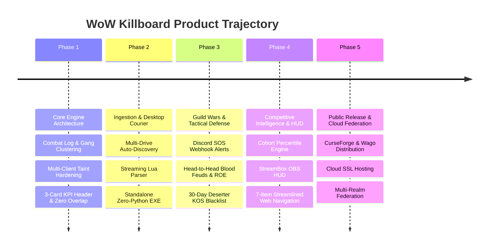

# Strategic Forward Roadmap & Product Execution Plan

This document outlines the strategic milestones, product phases, technical deliverables, and launch readiness gates for **WoW Killboard**.

---

## Strategic Trajectory Overview

---

## Phase 1: Core Engine & Combat Hardening (Status: COMPLETED)

**Milestone Objective**: Establish an infallible in-game combat telemetry engine, zero-taint UI, and end-to-end local data synchronization.

- [x] **Universal Combat Logging**: Hooks `COMBAT_LOG_EVENT_UNFILTERED` with runtime fallback detection across Classic Era (1.15.x), Forever Beta (`WowB.exe`), Anniversary, and Retail (11.x).
- [x] **Hostile Gang Clustering**: Temporal 15-second sliding window clustering algorithm distinguishing certified solo kills from gang ganks.
- [x] **1v1 Duel Match Engine**: Intercepts `CHAT_MSG_SYSTEM` for duel knockouts and forfeits; tracks dedicated duel wins, losses, and win percentages.
- [x] **Battleground Scoreboard Integration**: Real-time extraction of damage done, healing done, and objective score metrics via `UPDATE_BATTLEFIELD_SCORE`.
- [x] **Zero-Taint UI Redesign**:
  - Eliminated all Blizzard XML templates and `UISpecialFrames` taint.
  - Implemented custom ESC key handling (`SetPropagateKeyboardInput`).
  - Solved button overlap: guaranteed clear margins and responsive scaling.
  - Excised Arena context for strict Vanilla/Forever parity.
  - 3 wide tactical KPI cards: `SESSION COMBAT K/D`, `1v1 DUELS RECORD`, `BATTLEGROUNDS RECORD`.
- [x] **Bounty Escrow & Debt Ledger**: Player bounty placement, anti-win-trade heuristics, Oathbreaker state machine, proximity debtor sirens, and 1-click postal redemption.
- [x] **Automated Testing & Deployment**: Python test suite (`test_pipeline.py`, `validate_lua.py`) and automated deployment script (`scripts/deploy.py`) across all 4 client directories.

---

## Phase 2: Desktop Ingestion & Standalone Courier (Status: COMPLETED)

**Milestone Objective**: Establish a hands-off, zero-barrier desktop sync binary requiring zero technical knowledge from end users.

- [x] **Multi-Drive Auto-Discovery**:
  - Scans across `C:`, `D:`, and `E:` drives automatically for Warcraft WTF directories (`_classic_beta_`, `_classic_era_`, `_anniversary_`, `_retail_`).
- [x] **Streaming Recursive Descent Lua Parser**:
  - Custom zero-dependency lexer/parser ingesting SavedVariables files directly into structured payloads without requiring a Lua runtime.
- [x] **Single Self-Contained Executable (`WoWKillboardSync.exe`)**:
  - PyInstaller compiled runner (8.8 MB) requiring zero Python installation, terminal commands, or JSON config editing.
- [x] **Batched REST Ingestion**:
  - High-throughput deduplicating ingestion pipeline with cryptographic 32-bit FNV-1a hash matching.

---

## Phase 3: Guild Wars, Tactical Defense & Discord Network (Status: COMPLETED)

**Milestone Objective**: Equip guilds and war parties with coordinated tactical defense tools, automated alerting, and grudge match mechanics.

- [x] **War Horn & Call for Backup SOS Beacons**:
  - In-game `/warhorn` and `/kbsos` emergency beacons broadcast coordinates and enemy counts.
  - Automated party auto-invite triggers (`rally`, `war`, `backup`).
  - Web platform real-time SOS defense frequency monitor (`/api/backup/distress`).
- [x] **Discord War Room Webhook Network**:
  - Zero-dependency Discord embed dispatcher (`/api/discord/config`, `/api/discord/test`) broadcasting distress alerts and guild PvP events.
- [x] **Head-to-Head Blood Feuds & Custom ROE**:
  - Formal guild and 1v1 grudge match challenges with custom target score goals (e.g., First to 100 Kills).
  - Custom Rules of Engagement (ROE): Minimum level filters, 2x Underdog bonuses, anti-zerg scoring, and zone restrictions.
- [x] **Realm KOS Blacklist & 30-Day Deserter Stain**:
  - Defeated enemy guilds consigned to the public KOS blacklist with in-game proximity sirens.
  - 30-day anti-guild-hop tracking by permanent character Player-GUID to prevent evasion.
- [x] **Tactical Intel Recon Wire**:
  - Live scout sighting wire (`/api/intel/sightings`) broadcasting real-time enemy movements with coordinates and field notes.

---

## Phase 4: Competitive Intelligence, HUD & Streamlined Web (Status: COMPLETED)

**Milestone Objective**: Deploy deep combat analytics, streamer HUD integration, and an uncluttered, modern 7-item navigation architecture.

- [x] **Class, Spec & Level Cohort Percentile Engine**:
  - Mathematical cohort ranking calculating exact player standing (`percentile`, `topPct`, `rank`, `totalInCohort`) against all combatants sharing the exact same `(class, spec, level)` on the realm.
  - Dual-factor scoring: Total Kills primary, K/D ratio tie-breaker.
- [x] **Native Realm Player Armory & Classic Military Honor Titles**:
  - Complete character directory indexing all realm combatants with dynamic search, faction, and class filters.
  - Dynamic PvP rank title resolution: Scout through High Warlord (Horde) and Private through Grand Marshal (Alliance).
- [x] **War Correspondent HUD / StreamBox (`/war-hud/<name>`)**:
  - Zero-dependency transparent HTML/CSS/JS battlefield overlay built specifically for OBS Studio and Streamlabs.
- [x] **World Hazards & Deadly PvE NPC Casualties**:
  - Open-world environmental casualty telemetry tracking world bosses, elite patrol hazards, and wilderness executioners with complete PvP isolation.
- [x] **Streamlined 7-Item Navigation Architecture**:
  - Single-row header: **Logo** &bull; **Theater of War** &bull; **Intel** &bull; **Hall of Legends** &bull; **World Hazards** &bull; **Armory** &bull; **Bounties** &bull; **Warroom**.
  - Embedded 5-mode combat filter pills (`All PvP`, `World`, `BGs`, `Arenas`, `Duels`) placed inside Hall of Legends.
  - Header auth status badge (`👤 Username [Sign Out]` / `[Sign In]`).
- [x] **Sticky Top Combat & Leaderboard Filter Toolbar**:
  - Anchored directly above `#main-content-area` across desktop and mobile.
  - Row 1 (Timeframe): `[ 24 Hours ]`, `[ 7 Days ]`, `[ 30 Days ]`, `[ All-Time ]`.
  - Row 2 (Faction & Modes): `[ All ]`, `[ Alliance ]`, `[ Horde ]` | `[ World ]`, `[ BGs ]`, `[ Duels ]`, `[ Arenas ]`.
  - Mobile sticky sub-bar: `position: sticky; top: 56px; z-index: 900; background: rgba(11, 15, 23, 0.95); backdrop-filter: blur(8px); padding: 8px 12px;` on `<= 768px`.
- [x] **High-Density Combat Feed & Compact Single-Line Mobile Rows**:
  - Dual-layout system: 5-column fixed grid (`180px 1fr 44px 1fr 110px`) on desktop, compact single-line row (`38px–42px`) on mobile.
  - Capped initial combat feed display to 12 events with a compact `Load More Recent Kills` expansion trigger.
- [x] **Interactive Sortable Competitive Leaderboards**:
  - 4-Timeframe intervals (`24H`, `7D`, `30D`, `ALL`).
  - 10-Class Classic selector bar with class colors and instant re-ranking (`1..N`).
  - Interactive clickable column headers with directional indicator arrows (`▲`/`▼`) for all metrics.
- [x] **In-Game Feed Column Space Optimization & Compact Ability Icons**:
  - Replaced verbose boilerplate text (`slain by Combat Strike`) in PvP and PvE feeds with compact 18x18 ability icons and hover tooltips (`GameTooltip`).
  - Reallocated ~80px reclaimed column width: expanded `ZONE` by +64px (from `x = 512` to `x = 448`), completely eliminating ellipsis truncation.
  - Expanded `ATTACKER` and `VICTIM` columns to 168px each, preventing guild tag clipping.
- [x] **Integrated Character Portrait Medallion & Dynamic Level Updates**:
  - Prominent 48x48 character portrait at `(12, -8)` with 60x60 gold border ring, overlapping 20x20 circular level medallion at `(2, -2)`, and real-time level updating.
  - Title text `WoW Killboard v1.0.5` anchored vertically centered to portrait at `(10, 0)`.
- [x] **Clean Player Row Highlighting & Restyled Marked Track Buttons**:
  - Completely eliminated harsh yellow bounding box outlines around player rows (`[YOU]`), replacing them with subtle semi-transparent washes `(0.12, 0.16, 0.24, 0.35)`.
  - Restyled `Track` buttons in "THE MARKED" Card with dark slate theme, pale gold text, and radiant gold hover states.
- [x] **100% Ad-Free Community Supporter Framework**:
  - Zero commercial ads, zero tracking networks, and zero paywalls on in-game mechanics.
  - Optional community patron preview unlocking live Subzone Recon GPS on active bounties.

---

## Phase 5: Public Release & Phased Product Strategy (Status: ACTIVE / IN PROGRESS)

**Milestone Objective**: Execute the 3-Tier frictionless product distribution strategy, establishing a massive free player base via CurseForge, followed by the Track 2 monetized companion ecosystem.

### The 3-Track Phased Sequence:
1. **Track 1: In-Game Addon & Faction Mesh (Free Tier — Current Milestone)**:
   - Zero-app requirement: 100% in-game combat logging, local stats, and peer-to-peer guild/party/faction broadcast (`Sync.lua`).
   - Domain registration (`wowkillboard.com`) and HTTPS hardening on AWS Lightsail.
   - Initial CurseForge / Wago distribution for beta testers and early community adoption.
   - Community testing phase: Stabilize in-game combat reporting, eliminate edge-case bugs, and establish baseline realm activity.
2. **Track 2: Silent Desktop Companion & Supporter Pro Suite (Monetized Tier — After Beta Stabilization)**:
   - Implement 1-Click Silent Desktop Companion with native Windows System Tray integration (`console=False`, zero desktop terminal windows).
   - Automated startup with Windows for seamless, hands-off background ingestion.
   - Launch Supporter Pro subscription tiers ($5 - $15/mo) strictly honoring Blizzard's Addon Policy (monetizing out-of-game cloud services, real-time push pipelines, and Discord integrations).
3. **Track 3: Zero-Software Web Fallback (Post-Track 2 Milestone)**:
   - On-demand browser drag-and-drop ingestion (`/upload`) and `/kb export` string parser for Mac/Linux and zero-executable users.
   - Gated until Track 2 desktop companion and server sync pipeline are fully hardened.

---

## Supporter Pro Architecture & Monetization Blueprint

### Compliance with Blizzard Addon Policy
- **In-Game Code (Lua/XML)**: 100% free, open-source, and uninhibited on CurseForge with zero in-game paywalls or advertisements.
- **Out-of-Game Cloud Infrastructure**: Premium cloud hosting, Discord bot automation, real-time push streaming, and OBS widgets monetized via Patreon / Stripe.

### Supporter Tier Specifications

#### 1. Duelist & Bounty Hunter Tier ($4.99 / month)
- **Real-Time Minute-by-Minute Cloud Sync**: Kills and deaths published to the web live (sub-second) rather than waiting for daily realm batch updates.
- **Verified "Veteran" Web Profile**: Custom gold dragon border, military honor titles, and verified killboard crest.
- **Permanent Cold Case Vault**: Unlimited historical match and duel archive storage (free tier defaults to 30 days).
- **Custom Vanity Profile URL**: Direct branded URL (e.g. `wowkillboard.com/player/Dagariane`).
- **Target Wiretap Alerts**: Real-time push / Discord notification when a tracked bounty target is spotted online or enters a contested sector.

#### 2. Warband & Guild Command Tier ($14.99 / month per Guild)
- **Discord Defense Gateway Bot**:
  - Real-time automated Discord alert dispatch when any guildmate triggers an SOS distress beacon in-game.
  - Interactive response cards with target counts, coordinates, and team rally status.
- **Guild vs. Guild (GvG) Blood Feud Analytics**:
  - Head-to-head grudge match tracking between rival guilds with win rates, kill ratios, and officer bounties.
- **Officer Tactical Map**:
  - Live tactical radar showing guild patrol distribution and recently spotted enemy death squads.

#### 3. Streamer / Creator Add-On ($9.99 / month)
- **StreamBox OBS Battlefield HUD**: Transparent browser-source overlay for OBS Studio and Streamlabs showing live killstreaks, dynamic target elimination banners, and active bounty cards.
- **Twitch / YouTube Chat Bot**: Live chat command integration (`!bounty`, `!pvp`, `!stats`) reporting real-time in-game combat records.

