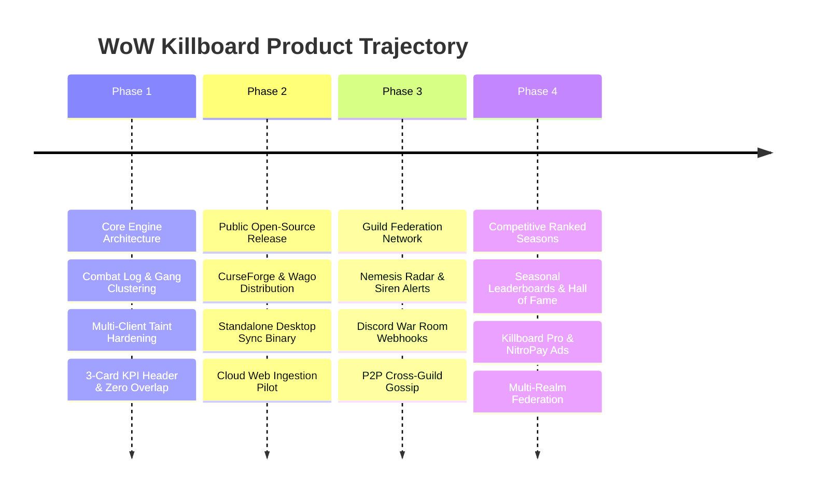

# Strategic Forward Roadmap & Product Execution Plan

This document outlines the strategic milestones, product phases, technical deliverables, and launch readiness gates for **WoW Killboard**.

---

## Strategic Trajectory Overview

---

## Phase 1: Core Engine & Combat Hardening (Status: COMPLETED)

**Milestone Objective**: Establish an infallible in-game combat telemetry engine, zero-taint UI, and end-to-end local data synchronization.

- [x] **Universal Combat Logging**: Hooks `COMBAT_LOG_EVENT_UNFILTERED` with runtime fallback detection across Classic Era (1.15.x), Forever Beta (`WowB.exe`), Anniversary, and Retail (11.x).
- [x] **Hostile Gang Clustering**: Temporal 15-second sliding window clustering algorithm distinguishing certified solo kills from gang ganks.
- [x] **1v1 Duel Match Engine**: Intercepts `CHAT_MSG_SYSTEM` for duel knockouts and forfeits; tracks dedicated duel wins, losses, and win percentages.
- [x] **Battleground Scoreboard Integration**: Real-time extraction of damage done, healing done, and objective score metrics via `UPDATE_BATTLEFIELD_SCORE`.
- [x] **Zero-Taint UI Redesign**:
  - Eliminated all Blizzard XML templates and `UISpecialFrames` taint.
  - Implemented custom ESC key handling (`SetPropagateKeyboardInput`).
  - Solved button overlap: 510px left tabs, 234px right filter pills, guaranteed **88px clear margin**.
  - Excised Arena context for strict Vanilla/Forever parity.
  - 3 wide tactical KPI cards: `SESSION COMBAT K/D`, `1v1 DUELS RECORD`, `BATTLEGROUNDS RECORD`.
- [x] **Bounty Escrow & Debt Ledger**: Player bounty placement, anti-win-trade heuristics, Oathbreaker state machine, proximity debtor sirens, and 1-click postal redemption.
- [x] **Automated Testing & Deployment**: Python test suite (`test_pipeline.py`, `validate_lua.py`) and automated PowerShell sync to all 4 client directories.

---

## Phase 2: Public Release & Community Adoption (Status: IN PROGRESS)

**Milestone Objective**: Package the system for public consumption across major addon repositories, establish open-source contribution channels, and launch the public web killboard.

### Action Items & Deliverables:
1. **Repository & Public Packaging**:
   - [ ] Initialize public GitHub repository with comprehensive README, license (GPLv3 or MIT), and code of conduct.
   - [ ] Establish automated GitHub Action CI/CD workflow to validate Lua syntax (`validate_lua.py`) on every push.
   - [ ] Package release zip files via GitHub Releases matching semantic version tags (`v1.0.0`).
2. **Addon Portal Distribution**:
   - [ ] Submit to **CurseForge** (`WoWKillboard.zip` matching interface versions `11503`, `11504`, `110002`).
   - [ ] Submit to **Wago.io** Addons portal.
   - [ ] Submit to **WoWInterface**.
3. **Public Web Host Deployment**:
   - [ ] Deploy Dockerized Flask + SQLite web platform to a production cloud server (DigitalOcean, AWS LightSail, or Heroku).
   - [ ] Configure SSL via Let's Encrypt (`https://killboard.forgedbyvalor.com` or similar domain).
   - [ ] Set up daily automated SQLite database backups.
4. **Desktop Sync Distribution**:
   - [ ] Distribute pre-compiled `WoWKillboardSync.exe` through GitHub Releases and the web platform download page.
   - [ ] Add auto-update check to `WoWKillboardSync.exe` to notify players when a new addon or sync version is published.

---

## Phase 3: Guild Federation & Nemesis Radar (Status: PLANNED)

**Milestone Objective**: Turn WoW Killboard into the primary competitive tool for world PvP guilds, alliance networks, and rival battleground premades.

### Action Items & Deliverables:
1. **Nemesis & KOS (Kill On Sight) Radar**:
   - Allow players and guilds to designate specific rival players or entire hostile guilds as **Nemesis / KOS**.
   - Triggers unique audio cues and visual crosshairs when a KOS target enters render distance.
2. **Discord "War Room" SaaS Integration**:
   - Ingest killmails and stream instant embeds to guild Discord channels via webhooks:
     - Solo kill spotlights with victim gear/damage breakdown.
     - Bounty announcements and bounty fulfillment payouts.
     - Weekly Guild MVP reports (Top Damage, Top Medic, Most Lethal Assassin).
3. **P2P Cross-Guild Gossip Mesh**:
   - Expand `Sync.lua` to route telemetry across alliance guilds using designated global custom chat channels (e.g., `WoWKillboardNet`).
   - Gossip deduplication to prevent packet storms and channel spam.

---

## Phase 4: Competitive Ranked Seasons & Monetization (Status: PLANNED)

**Milestone Objective**: Monetize the web platform sustainably, launch formal competitive PvP seasons, and provide premium analytical tooling for hardcore players.

### Action Items & Deliverables:
1. **Competitive Seasonal Leaderboards**:
   - 90-day seasonal cycles matching PvP patch cadences.
   - Seasonal Hall of Fame archiving champions across Solo K/D, Duelists, and BG Gladiators.
   - In-game titles or profile badges commemorating seasonal placements.
2. **Monetization Engine**:
   - **NitroPay / Playwire Display Ads**: Deploy responsive display containers (728x90 header, 300x250 sidebar) on the web dashboard.
   - **"Killboard Pro" ($4.99/mo via Stripe/Patreon)**:
     - 100% ad-free experience.
     - Custom animated gold borders and guild logos on the web platform.
     - Advanced analytical reports (Class Counter Matrix, Enemy Cooldown Usage, GPS Hotspot Heatmaps).
3. **Multi-Realm Federation**:
   - Separate server-wide aggregations by realm (e.g., WoW Forever Realm 1, Era Whitemane, Retail Illidan).
   - Global Realm-vs-Realm competitive standing.
