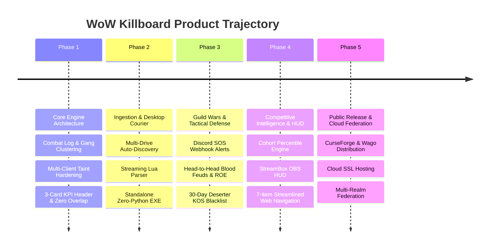

# Strategic Forward Roadmap & Product Execution Plan

This document outlines the strategic milestones, product phases, technical deliverables, and launch readiness gates for **WoW Killboard**.

---

## Strategic Trajectory Overview

---

## Phase 1: Core Engine & Combat Hardening (Status: COMPLETED)

**Milestone Objective**: Establish an infallible in-game combat telemetry engine, zero-taint UI, and end-to-end local data synchronization.

- [x] **Universal Combat Logging**: Hooks `COMBAT_LOG_EVENT_UNFILTERED` with runtime fallback detection across Classic Era (1.15.x), Forever Beta (`WowB.exe`), Anniversary, and Retail (11.x).
- [x] **Hostile Gang Clustering**: Temporal 15-second sliding window clustering algorithm distinguishing certified solo kills from gang ganks.
- [x] **1v1 Duel Match Engine**: Intercepts `CHAT_MSG_SYSTEM` for duel knockouts and forfeits; tracks dedicated duel wins, losses, and win percentages.
- [x] **Battleground Scoreboard Integration**: Real-time extraction of damage done, healing done, and objective score metrics via `UPDATE_BATTLEFIELD_SCORE`.
- [x] **Zero-Taint UI Redesign**:
  - Eliminated all Blizzard XML templates and `UISpecialFrames` taint.
  - Implemented custom ESC key handling (`SetPropagateKeyboardInput`).
  - Solved button overlap: guaranteed clear margins and responsive scaling.
  - Excised Arena context for strict Vanilla/Forever parity.
  - 3 wide tactical KPI cards: `SESSION COMBAT K/D`, `1v1 DUELS RECORD`, `BATTLEGROUNDS RECORD`.
- [x] **Bounty Escrow & Debt Ledger**: Player bounty placement, anti-win-trade heuristics, Oathbreaker state machine, proximity debtor sirens, and 1-click postal redemption.
- [x] **Automated Testing & Deployment**: Python test suite (`test_pipeline.py`, `validate_lua.py`) and automated deployment script (`scripts/deploy.py`) across all 4 client directories.

---

## Phase 2: Desktop Ingestion & Standalone Courier (Status: COMPLETED)

**Milestone Objective**: Establish a hands-off, zero-barrier desktop sync binary requiring zero technical knowledge from end users.

- [x] **Multi-Drive Auto-Discovery**:
  - Scans across `C:`, `D:`, and `E:` drives automatically for Warcraft WTF directories (`_classic_beta_`, `_classic_era_`, `_anniversary_`, `_retail_`).
- [x] **Streaming Recursive Descent Lua Parser**:
  - Custom zero-dependency lexer/parser ingesting SavedVariables files directly into structured payloads without requiring a Lua runtime.
- [x] **Single Self-Contained Executable (`WoWKillboardSync.exe`)**:
  - PyInstaller compiled runner (8.8 MB) requiring zero Python installation, terminal commands, or JSON config editing.
- [x] **Batched REST Ingestion**:
  - High-throughput deduplicating ingestion pipeline with cryptographic 32-bit FNV-1a hash matching.

---

## Phase 3: Guild Wars, Tactical Defense & Discord Network (Status: COMPLETED)

**Milestone Objective**: Equip guilds and war parties with coordinated tactical defense tools, automated alerting, and grudge match mechanics.

- [x] **War Horn & Call for Backup SOS Beacons**:
  - In-game `/warhorn` and `/kbsos` emergency beacons broadcast coordinates and enemy counts.
  - Automated party auto-invite triggers (`rally`, `war`, `backup`).
  - Web platform real-time SOS defense frequency monitor (`/api/backup/distress`).
- [x] **Discord War Room Webhook Network**:
  - Zero-dependency Discord embed dispatcher (`/api/discord/config`, `/api/discord/test`) broadcasting distress alerts and guild PvP events.
- [x] **Head-to-Head Blood Feuds & Custom ROE**:
  - Formal guild and 1v1 grudge match challenges with custom target score goals (e.g., First to 100 Kills).
  - Custom Rules of Engagement (ROE): Minimum level filters, 2x Underdog bonuses, anti-zerg scoring, and zone restrictions.
- [x] **Realm KOS Blacklist & 30-Day Deserter Stain**:
  - Defeated enemy guilds consigned to the public KOS blacklist with in-game proximity sirens.
  - 30-day anti-guild-hop tracking by permanent character Player-GUID to prevent evasion.
- [x] **Tactical Intel Recon Wire**:
  - Live scout sighting wire (`/api/intel/sightings`) broadcasting real-time enemy movements with coordinates and field notes.

---

## Phase 4: Competitive Intelligence, HUD & Streamlined Web (Status: COMPLETED)

**Milestone Objective**: Deploy deep combat analytics, streamer HUD integration, and an uncluttered, modern 7-item navigation architecture.

- [x] **Class, Spec & Level Cohort Percentile Engine**:
  - Mathematical cohort ranking calculating exact player standing (`percentile`, `topPct`, `rank`, `totalInCohort`) against all combatants sharing the exact same `(class, spec, level)` on the realm.
  - Dual-factor scoring: Total Kills primary, K/D ratio tie-breaker.
- [x] **Native Realm Player Armory & Classic Military Honor Titles**:
  - Complete character directory indexing all realm combatants with dynamic search, faction, and class filters.
  - Dynamic PvP rank title resolution: Scout through High Warlord (Horde) and Private through Grand Marshal (Alliance).
- [x] **War Correspondent HUD / StreamBox (`/war-hud/<name>`)**:
  - Zero-dependency transparent HTML/CSS/JS battlefield overlay built specifically for OBS Studio and Streamlabs.
- [x] **World Hazards & Deadly PvE NPC Casualties**:
  - Open-world environmental casualty telemetry tracking world bosses, elite patrol hazards, and wilderness executioners with complete PvP isolation.
- [x] **Streamlined 7-Item Navigation Architecture**:
  - Single-row header: **Logo** &bull; **Theater of War** &bull; **Intel** &bull; **Hall of Legends** &bull; **World Hazards** &bull; **Armory** &bull; **Bounties** &bull; **Warroom**.
  - Embedded 5-mode combat filter pills (`All PvP`, `World`, `BGs`, `Arenas`, `Duels`) placed inside Hall of Legends.
  - Header auth status badge (`👤 Username [Sign Out]` / `[Sign In]`).
- [x] **100% Ad-Free Community Supporter Framework**:
  - Zero commercial ads, zero tracking networks, and zero paywalls on in-game mechanics.
  - Optional community patron preview unlocking live Subzone Recon GPS on active bounties.

---

## Phase 5: Public Release, Cloud Hosting & Multi-Realm Federation (Status: ACTIVE / IN PROGRESS)

**Milestone Objective**: Deploy production cloud hosting, establish custom domain and SSL, distribute the addon to public community portals (CurseForge, Wago.io), and support multi-realm federation.

### Action Items & Deliverables:
1. **Production Cloud Infrastructure (Status: DEPLOYED & TESTED)**:
   - [x] Deploy Flask + SQLite platform to production AWS Lightsail instance (`13.216.102.148:8080`).
   - [x] Configure systemd service daemon (`wowkillboard.service`) for automatic process recovery.
   - [x] Enable SQLite Write-Ahead Logging (`PRAGMA journal_mode=WAL; PRAGMA busy_timeout=10000;`) for non-blocking concurrent writes.
   - [x] Automated stress testing suite (`scripts/stress_test.py`, `/kb stress [N]`) validating 168+ RPS throughput.
   - [x] Administrative database reset lifecycle with multi-table cascade purging.
2. **Domain Registration & SSL Hardening (Status: NEXT STEP)**:
   - [ ] Register public domain (e.g., `wowkillboard.com` via Cloudflare).
   - [ ] Configure DNS A-records pointing to AWS Lightsail elastic IP (`13.216.102.148`).
   - [ ] Configure automated SSL certificate provisioning via Let's Encrypt / Certbot or Cloudflare Edge SSL.
   - [ ] Update `KB.WebDomain` in Addon and `DEFAULT_PROD_URL` in `WoWKillboardSync.py` to custom HTTPS domain.
   - [ ] Recompile standalone binary `WoWKillboardSync.exe`.
3. **Public Addon Portals & Distribution (Status: QUEUED)**:
   - [ ] Submit package to **CurseForge** (`WoWKillboard-v1.0.0.zip` supporting interface versions `11503`, `11504`, `110002`).
   - [ ] Submit to **Wago.io** and **WoWInterface**.
   - [ ] Automated GitHub Release pipeline for semantic version tags.
4. **Multi-Realm Federation**:
   - [ ] Segment combat telemetry by Realm (WoW Forever Realm 1, Era Whitemane, Retail Illidan).
   - [ ] Realm-vs-Realm macro analytics and faction balance telemetry.

