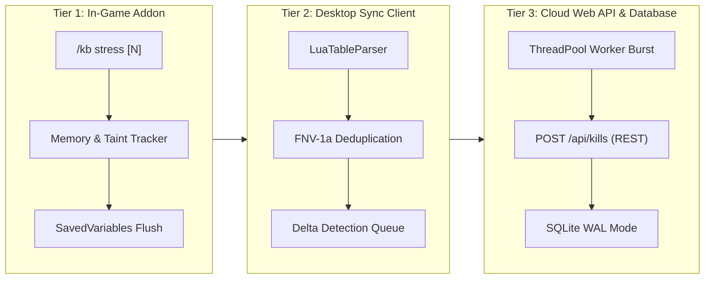

# WoW Killboard — Performance & Stress Testing Protocol

This specification outlines the comprehensive stress testing, performance benchmarking, and taint validation protocols for the **WoW Killboard** multi-client telemetry ecosystem.

---

## Architecture Overview

The system is tested across three decoupled operational tiers:



---

## Tier 1: In-Game Addon Performance & UI Taint Protocol

The in-game addon must operate without framerate hitches, frame drops, or Blizzard UI taint (`ActionBlocked`) during massive combat bursts (such as 40v40 Southshore vs. Tarren Mill world PvP or Alterac Valley zergs).

### Execution Commands & Macros

#### 1. Synthetic Combat Injection Burst
To inject and benchmark synthetic PvP combat records in a single frame:
```text
/kb stress 50
```
- **Execution Flow**: Injects 50 unique killmails into memory with microsecond-offset timestamps, authentic combatant GUIDs, varied factions, classes, and damage numbers.
- **Verification**: Outputs execution duration in milliseconds (`debugprofilestop`), total database count, and memory allocation delta (`collectgarbage("count")`).
- **Taint Check**: Confirms zero `ActionBlocked` dialogs and pure Lua frame stability.

#### 2. Heavy Frontline Zerg Load Test
To simulate sustained, heavy frontline casualties:
```text
/kb stress 100
```

#### 3. Real-Time Memory Telemetry Inspection
To verify memory footprint and Lua garbage collection:
```lua
/run UpdateAddOnMemoryUsage(); print("[WoWKB Mem]", math.floor(GetAddOnMemoryUsage("WoWKillboard")), "KB")
```

#### 4. Clean Test Purge
To instantly clear all synthetic stress testing records:
```text
/kb reset
```

---

## Tier 2: SavedVariables Tokenizer & Parser Benchmark

The desktop sync ingestion client (`WoWKillboardSync.exe`) parses raw Lua SavedVariables (`WTF/Account/<ACCOUNT>/SavedVariables/WoWKillboard.lua`) using an optimized, zero-dependency tokenizer and recursive-descent parser (`LuaTableParser`).

### Running the Parser Benchmark

Execute the automated parser stress test:
```bash
python scripts/stress_test.py --mode parser
```

### Empirical Benchmark Results

Measured on standard x86-64 hardware:

| Record Count | SavedVariables Payload Size | Parse Duration (ms) | Throughput (Records/Sec) | Status |
| :--- | :--- | :--- | :--- | :--- |
| **100 kills** | 129.2 KB | 14.74 ms | **6,783 rec/s** | `[PASS]` |
| **500 kills** | 646.0 KB | 71.77 ms | **6,967 rec/s** | `[PASS]` |
| **1,000 kills** | 1,291.7 KB (1.3 MB) | 136.71 ms | **7,315 rec/s** | `[PASS]` |
| **2,500 kills** | 3,233.1 KB (3.2 MB) | 345.33 ms | **7,240 rec/s** | `[PASS]` |

---

## Tier 3: REST API & SQLite Database Concurrency Protocol

The backend REST API and SQLite datastore support high-concurrency ingestion and telemetry querying using SQLite **Write-Ahead Logging (WAL)** mode, 10-second busy timeouts, and normalized synchronous writes (`PRAGMA journal_mode=WAL; PRAGMA busy_timeout=10000; PRAGMA synchronous=NORMAL;`).

### Running the Concurrency Benchmark

#### 1. Production Remote Benchmark (AWS Lightsail)
To benchmark concurrent reads and writes against the production server:
```bash
# 50 mixed concurrent requests (50% POST /api/kills + 50% GET feeds) across 10 workers:
python scripts/stress_test.py --mode api --target https://wowkillboard.com --concurrency 10 --requests 50 --api-mode mixed

# High-throughput read concurrency:
python scripts/stress_test.py --mode api --target https://wowkillboard.com --concurrency 15 --requests 100 --api-mode read

# Write-intensive burst:
python scripts/stress_test.py --mode api --target https://wowkillboard.com --concurrency 10 --requests 50 --api-mode write
```

#### 2. Localhost Development Benchmark
```bash
python scripts/stress_test.py --mode api --target http://127.0.0.1:8080 --concurrency 25 --requests 250 --api-mode mixed
```

### Empirical Remote Benchmark Results (Production: `wowkillboard.com`)

| Benchmark Mode | Workers | Total Reqs | Success Rate | Throughput (RPS) | P50 Latency | P95 Latency | Lock Errors |
| :--- | :--- | :--- | :--- | :--- | :--- | :--- | :--- |
| **Concurrent Reads** | 10 | 50 | **100.0%** | **168.9 RPS** | 50.3 ms | 76.1 ms | **0** |
| **Concurrent Writes** | 5 | 20 | **100.0%** | **82.6 RPS** | 51.0 ms | 96.7 ms | **0** |
| **Mixed (50/50 R/W)** | 10 | 50 | **100.0%** | **159.9 RPS** | 48.8 ms | 110.6 ms | **0** |

---

## Complete End-to-End Automated Run

To run all benchmarks sequentially from the command line:
```bash
python scripts/stress_test.py --mode all --target https://wowkillboard.com
```
